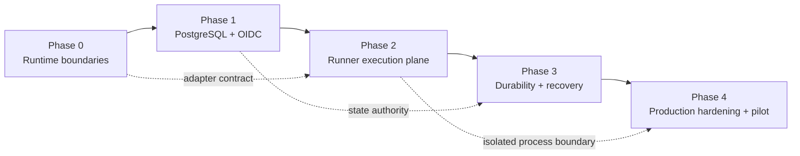

# Kubernetes Multi-Tenant Runtime Delivery Roadmap

> **For agentic workers:** REQUIRED SUB-SKILL: Use superpowers:subagent-driven-development (recommended) or superpowers:executing-plans to implement the linked plans task-by-task. Do not start a later phase until the previous phase Gate has recorded evidence.

**Goal:** Turn the approved Kubernetes multi-tenant Runtime V2 design into five independently testable delivery phases without replacing the current working local MVP in one large migration.

**Architecture:** Preserve the current FastAPI application as a modular control plane, introduce PostgreSQL-backed authority before remote execution, then add a Controller, Execution Gateway, isolated Runner Pod, S3-backed durable bundles, and production security controls in that order. Every phase keeps one supported execution path and has an explicit rollback boundary.

**Tech Stack:** Python 3.11+, FastAPI, SQLAlchemy async, Alembic, PostgreSQL 16, Claude Agent SDK (`0.2.128` baseline), MCP Python SDK (`1.29.0` baseline), Kubernetes 1.29+, CSI RWOP volumes, S3-compatible object storage, pytest, Hypothesis, Playwright, Kustomize.

## Approved Source

- Design: `docs/superpowers/specs/2026-07-29-kubernetes-multi-tenant-runtime-v2-design.md`
- Replaced design: `docs/superpowers/specs/2026-07-28-kubernetes-multi-tenant-runtime-design.md`
- Current baseline: local FastAPI process, SQLite-compatible persistence, in-process Turn execution, per-Session local workdir/transcript, and local user+Workspace Auto Memory.

## Global Invariants

- A personal space and a team space each map to one Product Workspace.
- Team Workspace members share only administrator-published read-only Knowledge, Config, Skill, and MCP Bundles.
- Session, message, attachment, workdir, transcript metadata, Artifact, and SSE content stay creator-private.
- PostgreSQL is the only authority for product state, queue state, leases, event history, generations, and object pointers.
- One active Session uses one short-lease Runner Pod; consecutive Turns reuse it until finalization plus the five-minute idle TTL.
- One Session has at most one active Turn. One `(user_id, workspace_id)` has at most one memory-active Turn.
- Session workdir and Claude transcript use one CSI `ReadWriteOncePod` PVC per Session.
- A new generation cannot start until the previous Pod is terminal and storage detach or node fencing is proven.
- Claude Agent SDK imports remain inside the runtime Adapter boundary. SDK and Runner image upgrades use cohorts and compatibility tests.
- The current Claude Agent SDK requires `mcp>=1.23.0,<2.0.0`; MCP v2 stays behind an explicit Adapter/canary Gate and is not a Phase 0-4 dependency.
- Agent processes never receive control-plane, database, S3, Kubernetes, model, MCP, or long-lived OBO credentials.
- Effective capability is the intersection of the immutable Session snapshot and the current authorization overlay; the overlay can only remove or constrain candidate capabilities.
- A Turn is never transparently replayed after its execution barrier. Unknown external write outcomes become `outcome_unknown`.
- Phase 1 does not add Redis, Outbox, vector memory, a custom SDK SessionStore, a custom scheduler, or a warm Pod pool.
- Production users and credentials remain blocked until the Phase 4 Gate passes.

## Delivery Dependency Graph



## Plans and Exit Gates

| Phase | Plan | Deliverable | Exit Gate |
|---|---|---|---|
| 0 | `2026-07-29-kubernetes-multi-tenant-runtime-phase-0-runtime-boundaries.md` | Internal runtime port, normalized events/results, SDK import guard, capability/cohort metadata, explicit inline dispatcher | Current local UI and API behavior unchanged; all existing tests pass |
| 1 | `2026-07-29-kubernetes-multi-tenant-runtime-phase-1-postgres-identity.md` | PostgreSQL production path, OIDC Principal, membership projection, creator-private SQL policy, durable queue/events/state machine | Two API replicas produce consistent authorization, idempotency, active-Turn, and SSE behavior |
| 2 | `2026-07-29-kubernetes-multi-tenant-runtime-phase-2-runner-execution-plane.md` | Controller, Execution Gateway, ordinary two-container Runner Pod, RWOP PVC, generations, execution barrier, hard-fence state, baseline Pod/Network security | Test Workspace completes cold start, execution, finalization, warm reuse, idle exit and live denial checks; no production credentials |
| 3 | `2026-07-29-kubernetes-multi-tenant-runtime-phase-3-memory-artifact-recovery.md` | S3 bundles, Personal Memory lease/CAS, Artifact service, Tool Operation Ledger, cross-node resume, restore/tombstone workflows | Fault injection and restore exercises pass without duplicate writer, memory corruption, or deleted-data resurrection |
| 4 | `2026-07-29-kubernetes-multi-tenant-runtime-phase-4-production-security-pilot.md` | Target-cluster sandbox hardening, dynamic OBO/revocation, quotas, audit, observability, SDK canary, backup and Pilot runbooks | All V2 section 21.4 production Gates pass before real multi-tenant credentials are enabled |

## Product Capabilities by Phase

Capabilities are cumulative. Phase 0-3 are engineering and pre-production milestones; Phase 4 is the first release allowed to serve a bounded real-user cohort.

| Phase | Who can use it | User-visible capability after the Gate | Explicitly unavailable |
|---|---|---|---|
| Current baseline | Local developer or trusted single-instance user | Workspace chat, private Sessions, attachments, managed Skills, configured MCP, resume, SSE, and user+Workspace Auto Memory | Real OIDC, safe public multi-tenancy, multiple API replicas, Kubernetes isolation |
| 0 | Same as current baseline | Same functionality and UI, backed by stable runtime/dispatcher contracts and a visible SDK/CLI/MCP capability report | No new multi-user or Kubernetes feature |
| 1 | Test users in integration environments | OIDC login, authorized personal/team Workspace discovery, creator-private data, idempotent requests, durable history and cross-replica SSE | Multi-replica Agent execution, Runner Pod, production users |
| 2 | Test Workspaces in the development cluster | Isolated Kubernetes Turns, same-Session warm reuse, cancellation, five-minute idle recycle, PVC resume, read-only test Skill/MCP | Production credentials/users and complete S3-backed Memory/Artifact durability |
| 3 | Pre-production test users | Durable attachments/Artifacts, Personal Auto Memory across Sessions/Runners, cross-node resume, recovery and unknown-outcome UX | Production admission, team dynamic memory, default non-idempotent writes |
| 4 | Bounded allowlisted real users | Production personal/team Workspaces with creator-private Sessions, attachments, Skill/read-only MCP, audited idempotent/reconcilable allowlist writes, Memory, Artifact, resume, dynamic revocation, quota and audit | General availability, non-idempotent writes, Session sharing, arbitrary images/stdio MCP, team dynamic memory |
| 5 | Later cohorts, per separately approved feature | Optional write-tool approval, team memory, deferred interaction, scheduling/cold-start optimization, SessionStore mirror, or multi-region | No bundled promise; each capability needs its own design and Gate |

## Supported Execution Modes by Phase

| Phase | `local_inline` | `kubernetes_runner` | Default |
|---|---:|---:|---|
| 0 | supported | absent | `local_inline` |
| 1 | single-instance development only | absent | multi-replica rehearsal uses `execution_disabled` |
| 2 | supported for development only | supported for test Workspaces | environment-controlled |
| 3 | supported for unit tests only | supported | `kubernetes_runner` outside local development |
| 4 | unsupported in production | production supported | `kubernetes_runner` |

The mode is selected by trusted server configuration, never by a browser request, Prompt, Skill, or MCP input.

## Migration and Rollback Rules

1. Database migrations are forward-only and additive until the Phase 3 data backfill is verified. Destructive column removal requires a separate cleanup release.
2. Each phase deploys code that can read the previous phase's rows before writing new fields.
3. Phase 2 keeps `local_inline` behind a development-only configuration flag until the Kubernetes vertical slice passes.
4. Runner candidate rollback means stopping new generation assignment to the candidate cohort. Sessions written by that cohort remain pinned until transcript compatibility is proven.
5. Object writes use immutable keys and database compare-and-swap pointers. Rollback changes pointers; it does not mutate old objects.
6. A rollback must not convert `outcome_unknown` or `recovery_required` to queued/running.
7. Phase 0 starts from or after baseline commit `f0dc04a`, which upgrades Claude Agent SDK to `0.2.128`, records the compatible MCP `1.29.0` lock, and preserves the SDK Skill adapter regression test. Untracked planning files in the repository root are unrelated and must remain untouched.

## Cross-Phase Verification Ledger

Create `docs/operations/runtime-v2-verification-ledger.md` during Phase 0. For every Gate append:

```text
phase
git_commit
database_revision
runner_image_digest
sdk_version
cluster_version
csi_driver_version
test_commands
test_results
known_exceptions
reviewer
verified_at
```

Do not overwrite prior evidence. A failed Gate records the failure and remediation commit.

## Deferred Until Measurements Justify Them

- Claude SDK custom SessionStore recovery mirror.
- Redis notification acceleration.
- Kueue-based fair scheduling.
- Kubernetes Job replacement semantics.
- Self-built warm Pod pool.
- Team-writable dynamic memory.
- MCP v2-only protocol features and non-idempotent write MCP enablement.
- Vector memory, fact extraction, or automatic memory merge.
- Multi-region or multi-cluster active/active execution.

## Recommended Execution Order

Start with Phase 0 in an isolated `codex/` worktree. Complete its verification ledger entry and merge it before creating Phase 1 migrations. Phase 2 should not start until a real development PostgreSQL instance and company CSI capability sheet are available, because generation and fencing semantics depend on those two authorities.
