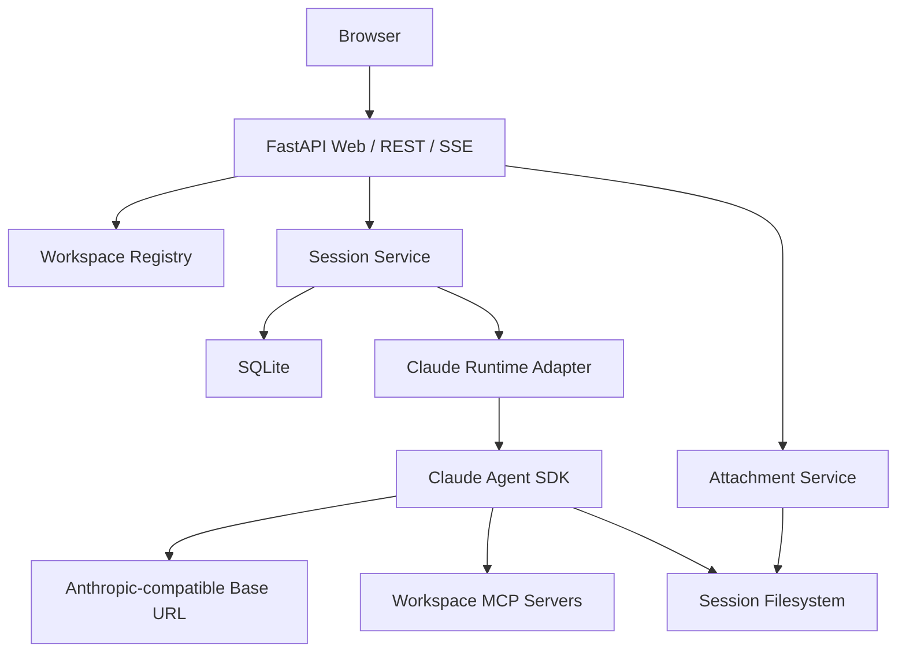

# Claude Workspace Agent MVP 需求与设计规格

## 1. 文档信息

| 项目 | 内容 |
| --- | --- |
| 项目名称 | Claude Workspace Agent MVP |
| 项目目录 | `/Users/a110356/work/code/claude_workspace_mvp` |
| 文档日期 | 2026-07-12 |
| 文档状态 | 待最终审阅 |
| 目标版本 | MVP v0.1 |
| 运行形态 | 单机、单用户、Python 单体页面服务 |
| Agent 运行时 | Claude Agent SDK Python |

## 2. 一句话定义

构建一个单用户 Web Agent 工作台：用户在页面选择服务端预配置的 Workspace，创建或选择历史 Session，上传图片或文件，并在持续可恢复的 Session 中与 Claude Agent 对话；Workspace 决定该 Session 可用的 Skills、MCP Server、模型和工具权限。

## 3. 背景与产品边界

企业已有的数据、系统和业务知识通过 MCP Gateway 与 Skills 提供给 Agent。MVP 不重新实现 Agent loop，而是使用 Claude Agent SDK 提供的会话、工具调用、Skills、MCP、多模态输入和上下文管理能力；本项目负责页面、Workspace 编排、Session 控制面、附件、持久化和权限边界。

MVP 是可独立运行的内部页面服务，不是演示脚本，也不是完整多租户平台。第一版必须把以下主链路跑通：

```text
选择 Workspace
  -> 创建或选择 Session
  -> 上传附件并发送消息
  -> Claude Agent 流式执行
  -> 展示回复与工具事件
  -> 保存页面历史与 Claude Session ID
  -> 页面或服务重启后恢复同一 Session
```

## 4. 已确认决策

1. MVP 为单用户内部服务，不包含登录。
2. Workspace 由服务端预配置，页面只允许选择，不允许创建、编辑或删除。
3. 服务从 `WORKSPACES_ROOT` 扫描 Workspace，每个一级子目录代表一个 Workspace。
4. Claude API 通过 Anthropic Messages API 兼容代理访问。
5. `ANTHROPIC_BASE_URL` 与 `ANTHROPIC_API_KEY` 只从服务端环境变量注入。
6. MVP 使用 SQLite 和本地文件系统持久化，不支持多实例部署。
7. 后端、页面和静态资源由一个 FastAPI 服务提供。
8. 页面使用 Jinja2、原生 HTML/CSS/JavaScript 和 SSE，不引入 Node 构建链。
9. 平台 Session 是持久化逻辑会话；Claude 子进程按 Turn 启动，Turn 完成后释放。
10. 后续 Turn 使用已保存的 Claude `session_id` 精确 `resume`，不使用“继续当前目录最近 Session”。
11. 每个 Session 拥有独立、稳定的 workspace 目录和 `CLAUDE_CONFIG_DIR`。
12. Session 创建时快照 Workspace 配置；本地 Skill 只复制被选择项，受信任外部 Skill 只建立被选择项的软链接。

## 5. 目标

### 5.1 产品目标

- 提供一个打开即用的 Agent 工作台首屏。
- 支持选择有效 Workspace。
- 支持创建、选择、重命名和删除历史 Session。
- 支持 Session 内持续多轮对话。
- 支持图片与普通文件附件。
- 支持流式展示文本、工具调用、工具结果、用量和错误。
- 支持页面刷新及服务重启后的历史恢复。
- 支持 Workspace 级 Skills、MCP 和工具权限配置。

### 5.2 工程目标

- 单条命令启动页面服务。
- 缺失关键配置时快速失败并给出明确错误。
- 真实 Claude 调用与页面业务逻辑解耦，默认测试不消耗模型额度。
- API Key、MCP Token 不进入浏览器、数据库和普通日志。
- Session、Turn、附件和执行事件具有确定的状态机。
- 代码模块边界清晰，可在后续替换 SQLite、本地附件存储或 Claude 运行时。

## 6. 非目标

MVP 明确不实现：

- 登录、用户、组织、租户与 RBAC。
- Workspace、Skill、MCP 的页面管理后台。
- PostgreSQL、Redis、S3 或外部 Claude `SessionStore`。
- 多实例、跨主机恢复、任务队列和分布式锁。
- 人工工具审批页面。
- Session 分享、导出和全文搜索。
- 语音输入和移动端原生应用。
- 模型在页面动态切换。
- 运行中的 Session 动态增删 Skill 选择；受信任外部 Skill 的源文件更新除外。
- 计费、额度管理和运营后台。
- 长驻 Claude 进程池或预热池。

## 7. 核心术语

| 术语 | 定义 |
| --- | --- |
| Workspace Template | `WORKSPACES_ROOT` 下的服务端预配置目录，包含 `workspace.yaml`、Skills、指令和种子文件 |
| Session | 页面中的一段可恢复对话，绑定一个 Workspace 快照和一个 Claude Session ID |
| Session Workspace | Session 创建时从 Workspace Template 物化出的独立工作目录 |
| Turn | 用户的一次发送以及由此触发的完整 Agent 执行过程 |
| Message Event | 用户消息、Claude 文本、工具调用、工具结果、用量、错误等可持久化事件 |
| Attachment | 上传到 Session、可关联到某个 Turn 的图片或普通文件 |
| Claude Session ID | Claude Agent SDK 返回的底层会话标识，用于精确恢复上下文 |

## 8. 用户故事

### 8.1 Workspace 与 Session

- 作为用户，我可以看到所有有效 Workspace 及其能力摘要。
- 作为用户，我可以选择 Workspace 并查看该 Workspace 的历史 Session。
- 作为用户，我可以新建 Session，并在首次发送时启动 Claude 会话。
- 作为用户，我可以打开历史 Session，查看完整页面记录并继续对话。
- 作为用户，我可以重命名或删除 Session。

### 8.2 对话与附件

- 作为用户，我可以发送纯文本消息并实时看到 Claude 回复。
- 作为用户，我可以上传图片并让 Claude 直接理解图片内容。
- 作为用户，我可以上传 PDF、文本、CSV、JSON、YAML 或代码文件，让 Agent 从 Session workspace 读取。
- 作为用户，我可以看到工具开始、工具结束、错误和最终完成状态。
- 作为用户，我可以停止正在执行的 Turn。

### 8.3 恢复与错误

- 作为用户，我刷新页面后不会丢失已完成的聊天记录。
- 作为用户，我重启服务后仍能选择历史 Session 并继续对话。
- 作为用户，我遇到代理鉴权、限流或工具失败时能看到可理解的错误，且 Session 仍可再次发送。

## 9. 页面需求

### 9.1 页面结构

首屏直接显示 Agent 工作台，不提供营销页或功能介绍页。

```text
┌──────────────────────────────────────────────────────────────────┐
│ Workspace 选择器                         当前能力摘要 / 服务状态 │
├──────────────────────┬───────────────────────────────────────────┤
│ 新建 Session         │ Session 标题                    重命名/删除│
│                      ├───────────────────────────────────────────┤
│ Session 列表         │ 消息时间线                                 │
│ - 标题               │ - 用户消息与附件                           │
│ - 更新时间           │ - Claude 文本                              │
│ - 状态               │ - 工具调用与结果（可折叠）                 │
│                      │ - 错误与用量                               │
│                      ├───────────────────────────────────────────┤
│                      │ 附件预览区                                 │
│                      │ 多行输入框              上传 / 发送 / 停止│
└──────────────────────┴───────────────────────────────────────────┘
```

### 9.2 Workspace 选择

- 首次进入页面时自动选择第一个有效 Workspace。
- 下拉项展示 Workspace 名称，不展示服务端绝对路径。
- 无有效 Workspace 时显示阻塞性空状态和配置错误摘要。
- 切换 Workspace 后加载对应 Session 列表，不自动创建 Session。
- Workspace 能力摘要显示启用的 Skill 数量、MCP Server 数量和模型名称。

### 9.3 Session 列表

- 按 `updated_at` 倒序排列。
- 每项显示标题、最后更新时间和状态。
- 状态仅展示 `idle`、`running`、`error`、`interrupted`。
- 新 Session 标题为“新会话”；首次用户消息完成保存后，若用户未手动改名，自动取首条消息前 30 个字符。
- 选择历史 Session 后加载全部平台 Message Events，并滚动到底部。
- 删除必须二次确认；删除成功后选择列表中的下一项，若为空则显示空状态。

### 9.4 聊天区域

- 文本回复按增量流式追加，增量不得导致布局跳动。
- 工具调用显示工具名、状态和耗时；输入与结果默认折叠。
- 工具输入或输出超过 8,000 字符时页面仅展示截断预览，数据库保存标准化后的完整允许内容。
- 页面不展示 Claude thinking 内容。
- Turn 运行期间发送按钮切换为停止按钮，输入框和附件上传禁用。
- 同一 Session 同时只允许一个运行中 Turn。
- 切换到其他 Session 不取消原 Turn；列表状态继续显示 `running`。

### 9.5 附件交互

- 支持文件选择和拖放。
- 上传成功后显示文件名、大小、类型和移除按钮。
- 发送前移除附件会删除尚未绑定 Turn 的附件记录和文件。
- 图片显示缩略图；其他文件显示类型图标。
- 默认单文件上限 20 MiB，每个 Turn 最多 5 个附件。
- 页面在选择文件时先做前置校验，服务端必须重复校验。

### 9.6 响应式与可访问性

- 桌面端为双栏布局。
- 窄屏下 Session 列表变为可打开的侧栏，聊天输入始终可见。
- 所有图标按钮具备 tooltip 和 `aria-label`。
- 状态不能只依赖颜色表达。
- 键盘支持 `Enter` 发送、`Shift+Enter` 换行；输入法组合状态不得误发送。

## 10. Workspace Template 规范

### 10.1 目录结构

```text
${WORKSPACES_ROOT}/
└── sales-analysis/
    ├── workspace.yaml
    ├── CLAUDE.md
    ├── .claude/
    │   └── skills/
    │       ├── sql-analysis/
    │       │   └── SKILL.md
    │       └── report-generator/
    │           └── SKILL.md
    └── seed/
        └── reference.md
```

`CLAUDE.md` 与 `seed/` 可选；`workspace.yaml` 必需。

### 10.2 `workspace.yaml` 模式

```yaml
version: 1
id: sales-analysis
name: 销售分析
description: 查询销售数据并生成分析报告

model: claude-sonnet-4-6

skills:
  - sql-analysis
  - report-generator

allowed_tools:
  - Read
  - Write
  - Edit
  - Glob
  - Grep
  - WebSearch
  - WebFetch
  - Skill
  - mcp__data_gateway__*

mcp_servers:
  data_gateway:
    type: http
    url_env: DATA_GATEWAY_MCP_URL
    authorization_env: DATA_GATEWAY_MCP_TOKEN
```

### 10.3 字段规则

| 字段 | 必需 | 规则 |
| --- | --- | --- |
| `version` | 是 | MVP 只接受整数 `1` |
| `id` | 是 | 与目录名一致；匹配 `[a-z0-9][a-z0-9_-]{1,63}` |
| `name` | 是 | 非空，最多 80 字符 |
| `description` | 是 | 非空，最多 500 字符 |
| `model` | 否 | 未配置时使用 `CLAUDE_MODEL` |
| `skills_root_env` | 否 | 外部 Skill 根目录的服务端环境变量名；配置后使用受控软链接模式 |
| `skills` | 是 | 字符串数组，可为空；每项必须对应一个有效 Skill 目录 |
| `allowed_tools` | 是 | 字符串数组，可使用末尾 `*` 匹配 MCP 工具前缀 |
| `mcp_servers` | 是 | 对象，可为空；MVP 只支持 HTTP MCP |

### 10.4 Workspace 校验

- 扫描只读取 `WORKSPACES_ROOT` 的一级子目录。
- 软链接 Workspace 目录无效。
- `id` 重复时，所有冲突项均标记无效。
- 本地 `skills` 引用不存在的目录、缺失 `SKILL.md` 或存在软链接时，Workspace 无效。
- 配置 `skills_root_env` 时，对应变量必须指向真实绝对目录；该目录内的 Skill 可以是软链接。
- Skill 名只能使用字母、数字、点、下划线和连字符，不允许路径分隔符或路径穿越。
- `mcp_servers.*.url_env` 对应环境变量缺失时，Workspace 无效。
- `authorization_env` 允许省略；配置后对应环境变量必须存在。
- 单个 Workspace 无效不阻止服务启动；API 返回其不可用状态和脱敏错误。
- Session 不能基于无效 Workspace 创建。

### 10.5 Session 物化规则

创建 Session 时执行：

1. 创建 `data/sessions/<session-id>/workspace/`。
2. 复制 `CLAUDE.md`，若不存在则生成最小平台指令文件。
3. 将 `seed/` 内容复制到 Session workspace 根目录。
4. 将 `skills` 清单中的本地 Skill 复制到 `.claude/skills/`；外部 Skill 仅创建指向受信任根目录的软链接。
5. 创建 `attachments/` 和 `outputs/`。
6. 创建独立的 `claude-config/`。
7. 保存规范化 `workspace.yaml` 快照和 SHA-256 哈希。

已有 Session 永不从模板自动同步。模板变更只影响后续创建的 Session；外部软链接模式下，源 Skill 文件更新会影响已有 Session。

## 11. 环境变量

### 11.1 必需变量

```env
ANTHROPIC_BASE_URL=https://proxy.example.com
ANTHROPIC_API_KEY=replace-with-secret
WORKSPACES_ROOT=/absolute/path/to/workspaces
```

规则：

- `ANTHROPIC_BASE_URL` 必须是有效的 `http` 或 `https` URL；生产建议仅允许 `https`。
- `ANTHROPIC_API_KEY` 去除首尾空白后不能为空。
- `WORKSPACES_ROOT` 必须是存在、可读的绝对目录，且不能是软链接。
- 任一变量缺失或无效时服务拒绝启动，错误中只出现变量名，不出现变量值。

### 11.2 可选变量与默认值

```env
CLAUDE_MODEL=claude-sonnet-4-6
CLAUDE_SKILLS_ROOT=/absolute/path/to/.claude/skills
APP_HOST=127.0.0.1
APP_PORT=8000
APP_DATA_DIR=./data
DATABASE_URL=sqlite+aiosqlite:///./data/app.db
MAX_UPLOAD_SIZE_MB=20
MAX_FILES_PER_TURN=5
TURN_TIMEOUT_SECONDS=900
SSE_HEARTBEAT_SECONDS=15
LOG_LEVEL=INFO
```

### 11.3 注入方式

- 配置由 Pydantic Settings 在进程启动时读取。
- 本地开发允许从项目根目录 `.env` 读取；`.env` 必须被 Git 忽略。
- 仓库只提供 `.env.example`，不得包含真实密钥。
- 启动 Claude SDK 时构造子进程环境，显式包含：

```text
ANTHROPIC_BASE_URL=<服务端设置值>
ANTHROPIC_API_KEY=<服务端设置值>
CLAUDE_CONFIG_DIR=<该 Session 的 claude-config 绝对路径>
```

- API Key 不作为 CLI 参数、Prompt、数据库字段、HTTP 响应或日志字段传递。
- MCP URL 和 Token 从 Workspace 配置引用的环境变量解析，并只传给当前 Claude 运行时。

## 12. 技术架构

### 12.1 技术栈

```text
Python 3.11+
FastAPI + Uvicorn
Jinja2 + 原生 HTML/CSS/JavaScript
Server-Sent Events
SQLAlchemy 2.x Async + SQLite + aiosqlite
Pydantic v2 + pydantic-settings
Claude Agent SDK Python
PyYAML
python-multipart
pytest + pytest-asyncio + httpx
Playwright
uv
```

### 12.2 组件关系



### 12.3 模块边界

```text
app/config.py
  读取环境变量、执行启动校验、提供脱敏配置视图

app/workspaces/
  扫描模板、解析 YAML、校验 Skills/MCP、生成配置快照

app/sessions/
  Session/Turn 状态机、标题、并发锁、创建/恢复/删除

app/attachments/
  上传校验、文件名处理、哈希、保存、删除、Prompt 附件构造

app/claude_runtime/
  SDK 选项、消息生成、事件标准化、取消、异常转换

app/db/
  SQLAlchemy 模型、事务、查询与初始化

app/api/
  REST、SSE、请求/响应模型和错误映射

app/web/
  Jinja 页面、静态 JavaScript、CSS 和浏览器状态管理
```

## 13. Session 与 Claude 运行时

### 13.1 逻辑 Session

平台 Session 在数据库和文件系统中长期存在，不等同于一个常驻 Claude 进程。每次 Turn 创建一个短生命周期 `ClaudeSDKClient`：

```text
POST Turn
  -> 获取 Session 进程内锁
  -> 读取 Session 配置快照
  -> 构造 ClaudeAgentOptions
  -> 若 claude_session_id 存在则设置 resume
  -> 发送一条 streaming-input UserMessage
  -> 流式消费 SDK 消息
  -> 保存 ResultMessage.session_id 与 usage
  -> 关闭 ClaudeSDKClient
  -> 释放锁
```

### 13.2 SDK 选项

运行时必须设置：

```text
cwd=<session workspace absolute path>
resume=<existing claude_session_id or None>
model=<workspace snapshot model>
setting_sources=["project"]
skills=<workspace snapshot skills>
mcp_servers=<resolved snapshot MCP configuration>
strict_mcp_config=true
allowed_tools=<workspace snapshot allowed tools>
env=<sanitized child process environment>
```

使用 Claude Code system prompt preset，并通过 Session workspace 的 `CLAUDE.md` 注入 Workspace 持久规则。禁止把长期规则只放在首条用户消息中。

### 13.3 首次 Turn

- 创建平台 Session 时 `claude_session_id` 为 `null`。
- 第一次发送成功收到 `ResultMessage` 后保存其 `session_id`。
- 第一次发送在收到结果前失败时，平台 Session 仍存在，用户可以重试。
- 如果失败流中已得到可确认的 Claude Session ID，则允许保存；否则下一次重试创建新的底层会话。

### 13.4 后续 Turn

- 必须使用数据库中精确的 `claude_session_id` 设置 `resume`。
- 必须使用与首次 Turn 相同的 Session workspace 绝对路径和 `CLAUDE_CONFIG_DIR`。
- `resume` 失败时 Turn 标记失败，不自动创建新 Claude Session，避免用户误以为上下文仍在。
- 页面给出“底层会话无法恢复”错误；MVP 不提供自动迁移或重建按钮。

### 13.5 上下文压缩

- Claude Agent SDK 默认自动压缩接近上限的上下文。
- 收到 `system/compact_boundary` 时保存事件、触发类型和压缩前 Token 数。
- 压缩只影响模型可见上下文，不得删除平台 Message Events。
- 页面历史始终来自 SQLite，而不是仅来自 SDK `get_session_messages()`。
- Workspace 长期规则保存在 `CLAUDE.md`，以便压缩后重新注入。

## 14. 附件设计

### 14.1 支持类型

MVP 允许：

- 图片：JPEG、PNG、GIF、WebP。
- 文档：PDF、TXT、Markdown。
- 数据：CSV、JSON、YAML、XML。
- 常见 UTF-8 源代码文件。

MVP 拒绝可执行文件、设备文件、软链接和无法识别的二进制文件。ZIP、Office 文档和视频不在 MVP 范围。

### 14.2 保存路径

```text
data/sessions/<session-id>/workspace/attachments/
└── <attachment-uuid>__<sanitized-extension>
```

磁盘文件名不使用用户原始文件名；原始文件名只保存在数据库并按 HTML 文本转义展示。

### 14.3 图片输入

- 上传时保存原文件并计算 SHA-256。
- 构造 streaming-input UserMessage 时读取图片并转换为 base64 `image` content block。
- 同一消息包含用户文本块和一个或多个图片块。
- 图片仍保存在 Session workspace，保证页面历史可预览。

### 14.4 普通文件输入

- 文件保存到 Session workspace 后不把完整内容直接塞入 Prompt。
- 用户消息后追加平台生成的文本块，列出附件显示名和绝对路径，并要求 Agent 按需使用 `Read` 或其他获准工具读取。
- 附件路径必须位于当前 Session workspace 内。

### 14.5 生命周期

- 上传后、发送前的附件状态为 `pending`。
- 创建 Turn 时附件原子绑定到该 Turn，状态变为 `bound`。
- 已绑定附件不能被其他 Turn 重复绑定。
- 删除 Session 时删除全部附件。
- 删除尚未绑定附件时立即删除磁盘文件和数据库记录。
- 服务启动时清理超过 24 小时且仍为 `pending` 的孤立附件。

## 15. Skill 与 MCP 设计

### 15.1 Skill 选择

- Workspace Template 可以包含多个 Skill。
- `workspace.yaml.skills` 是 Session 启动时的选择清单。
- Session 创建时只把清单内 Skill 复制或软链接到 Session workspace。
- SDK 同时接收同一清单作为 `skills` 参数。
- `skills=[]` 表示该 Workspace Session 不启用任何 Skill。
- 已创建 Session 的 Skill 选择清单不可变；本地复制模式内容不可变，外部软链接模式会跟随源文件更新。

这种“配置过滤 + 物理复制或服务端受信任链接”限制模型可见的 Skill 集合；不能只依赖 SDK 的 Skill 过滤器作为安全隔离。外部链接模式只适用于单用户、受信任的本机 Skill 根目录。

### 15.2 MCP Server

- MVP 只支持 HTTP MCP Server。
- MCP URL 和可选 Bearer Token 均通过环境变量解析。
- `strict_mcp_config=true`，不加载用户级或机器级额外 MCP。
- MCP Server 名称进入工具命名空间，例如 `mcp__data_gateway__query`。
- 页面显示 MCP 名称和连接状态，不显示 URL、Header 或 Token。
- 单个 MCP 连接失败不导致服务退出，但当前 Turn 是否可继续由 Claude SDK 结果决定。

### 15.3 工具权限

- `allowed_tools` 是 Workspace 快照的一部分。
- 工具名支持完全匹配和末尾 `*` 前缀匹配。
- 服务端权限回调允许匹配项，拒绝其余工具。
- 不使用 `bypassPermissions`。
- MVP 不弹出人工审批；被拒绝的工具作为标准工具错误返回 Claude 并记录事件。
- 页面不能修改工具清单。

## 16. 数据模型

所有主键为字符串 UUID；时间统一存储 UTC ISO 8601，API 返回带 `Z` 的 UTC 时间。

### 16.1 `sessions`

| 字段 | 类型 | 约束 |
| --- | --- | --- |
| `id` | string | 主键 |
| `workspace_id` | string | 非空、索引 |
| `claude_session_id` | string nullable | 唯一索引 |
| `title` | string | 非空，最多 120 字符 |
| `title_source` | enum | `auto` 或 `user` |
| `status` | enum | `idle/running/error/interrupted` |
| `workspace_snapshot_json` | JSON text | 非空、不可变 |
| `workspace_snapshot_hash` | string | SHA-256 |
| `session_dir` | string | 服务端内部相对路径 |
| `last_error_code` | string nullable | 脱敏错误码 |
| `created_at` | datetime | 非空 |
| `updated_at` | datetime | 非空、索引 |

### 16.2 `turns`

| 字段 | 类型 | 约束 |
| --- | --- | --- |
| `id` | string | 主键 |
| `session_id` | string | 外键、级联删除、索引 |
| `client_request_id` | string | 与 `session_id` 组成唯一约束 |
| `status` | enum | `queued/running/completed/failed/cancelled/interrupted` |
| `input_text` | text | 非空，允许仅附件时为空字符串 |
| `error_code` | string nullable | 脱敏错误码 |
| `error_message` | text nullable | 用户可见脱敏信息 |
| `input_tokens` | integer nullable | 非负 |
| `output_tokens` | integer nullable | 非负 |
| `cost_usd` | decimal nullable | 非负 |
| `started_at` | datetime nullable |  |
| `completed_at` | datetime nullable |  |
| `created_at` | datetime | 非空 |

每个 Session 最多存在一个 `queued` 或 `running` Turn；应用层锁和数据库条件检查共同保证。

### 16.3 `messages`

该表同时作为页面事件存储和 SSE 重放来源。

| 字段 | 类型 | 约束 |
| --- | --- | --- |
| `id` | string | 主键 |
| `session_id` | string | 外键、级联删除、索引 |
| `turn_id` | string | 外键、级联删除、索引 |
| `sequence` | integer | Turn 内单调递增 |
| `event_type` | string | 标准 SSE 事件名 |
| `role` | string nullable | `user/assistant/tool/system` |
| `payload_json` | JSON text | 已脱敏标准化事件 |
| `created_at` | datetime | 非空 |

`turn_id + sequence` 唯一。浏览器通过该序号执行 SSE 重放和去重。

### 16.4 `attachments`

| 字段 | 类型 | 约束 |
| --- | --- | --- |
| `id` | string | 主键 |
| `session_id` | string | 外键、级联删除、索引 |
| `turn_id` | string nullable | 外键、绑定后不可修改 |
| `status` | enum | `pending/bound` |
| `original_filename` | string | 展示用途 |
| `stored_filename` | string | 服务端生成 |
| `mime_type` | string | 服务端检测结果 |
| `size_bytes` | integer | 非负 |
| `sha256` | string | 64 位十六进制 |
| `relative_path` | string | Session 内相对路径 |
| `created_at` | datetime | 非空 |

## 17. 文件系统布局

```text
claude_workspace_mvp/
├── app/
├── tests/
├── workspaces/
│   └── example/
├── docs/
├── scripts/
├── data/                    # Git ignored
│   ├── app.db
│   └── sessions/
│       └── <session-id>/
│           ├── workspace/
│           │   ├── CLAUDE.md
│           │   ├── workspace.snapshot.yaml
│           │   ├── .claude/skills/
│           │   ├── attachments/
│           │   └── outputs/
│           └── claude-config/
├── .env.example
├── pyproject.toml
└── README.md
```

数据库中的路径一律保存为相对 `APP_DATA_DIR` 的规范化路径，禁止保存用户提交的绝对路径。

## 18. REST API 契约

所有 API 返回 JSON，SSE 除外。错误统一格式：

```json
{
  "error": {
    "code": "session_busy",
    "message": "This session already has a running turn.",
    "request_id": "uuid"
  }
}
```

### 18.1 健康检查

`GET /api/health`

```json
{
  "status": "ok",
  "database": "ok",
  "workspace_count": 2,
  "valid_workspace_count": 1
}
```

不得检查或回显 API Key。MVP 健康检查不主动调用 Claude 代理。

### 18.2 Workspace

`GET /api/workspaces`

返回有效和无效 Workspace。每项包含 `id`、`name`、`description`、`available`、`model`、`skill_count`、`mcp_server_count` 和脱敏 `validation_errors`。

`GET /api/workspaces/{workspace_id}`

返回单个 Workspace 能力摘要；不返回路径、MCP URL 或环境变量值。

### 18.3 Session

`GET /api/workspaces/{workspace_id}/sessions`

返回该 Workspace 的 Session，按 `updated_at desc`。

`POST /api/workspaces/{workspace_id}/sessions`

请求无正文。成功返回 HTTP 201：

```json
{
  "id": "platform-session-uuid",
  "workspace_id": "sales-analysis",
  "title": "新会话",
  "status": "idle",
  "claude_session_id": null,
  "created_at": "2026-07-12T08:00:00Z",
  "updated_at": "2026-07-12T08:00:00Z"
}
```

`GET /api/sessions/{session_id}` 返回详情。

`PATCH /api/sessions/{session_id}` 只接受：

```json
{"title": "新的标题"}
```

标题去除首尾空白后长度为 1 至 120。

`DELETE /api/sessions/{session_id}`

- 运行中的 Session 返回 HTTP 409。
- 成功删除数据库和文件后返回 HTTP 204。

`GET /api/sessions/{session_id}/messages`

返回按 Turn 和 sequence 排序的标准化页面事件。MVP 不分页，但单次响应上限为 10,000 条；超过时返回 HTTP 413 和明确错误，避免无界响应。

### 18.4 附件

`POST /api/sessions/{session_id}/attachments`

- `multipart/form-data`，字段名 `files`。
- 一次最多上传 `MAX_FILES_PER_TURN` 个文件。
- 成功返回 HTTP 201 和附件数组。
- 任一文件无效时整个请求失败，已写入的临时文件全部回滚。

`DELETE /api/attachments/{attachment_id}`

- 只允许删除 `pending` 附件。
- 成功返回 HTTP 204。

`GET /api/attachments/{attachment_id}/content`

- 仅用于页面预览或下载。
- 设置安全的 `Content-Type` 和 `Content-Disposition`。
- 不允许浏览任意服务器路径。

### 18.5 Turn

`POST /api/sessions/{session_id}/turns`

```json
{
  "message": "分析这些数据",
  "attachment_ids": ["attachment-uuid"],
  "client_request_id": "browser-generated-uuid"
}
```

规则：

- `message` 去除首尾空白后可为空，但此时必须至少有一个附件。
- 所有附件必须属于当前 Session 且状态为 `pending`。
- 同一 `client_request_id` 重试返回原 Turn，不重复执行。
- Session 已有活动 Turn 时返回 HTTP 409。
- 成功返回 HTTP 202：

```json
{
  "turn_id": "turn-uuid",
  "status": "queued",
  "events_url": "/api/turns/turn-uuid/events"
}
```

`GET /api/turns/{turn_id}/events`

- 响应类型 `text/event-stream`。
- 支持 `Last-Event-ID` Header。
- 先重放数据库中 sequence 大于 Last-Event-ID 的事件，再订阅实时事件。
- 已结束 Turn 在重放完毕后关闭连接。
- 活动 Turn 每 `SSE_HEARTBEAT_SECONDS` 发送 heartbeat。

`POST /api/turns/{turn_id}/cancel`

- 只允许取消 `queued` 或 `running` Turn。
- 重复取消幂等。
- 成功返回 HTTP 202。

## 19. SSE 事件契约

SSE `id` 为 Turn 内 `sequence`，`event` 为事件类型，`data` 为 JSON。

| 事件 | 必需字段 | 说明 |
| --- | --- | --- |
| `turn.started` | `turn_id`, `started_at` | Claude 执行开始 |
| `message.user` | `text`, `attachments` | 已持久化用户输入 |
| `message.assistant.delta` | `text` | 文本增量 |
| `message.assistant.completed` | `text` | 完整回复 |
| `tool.started` | `tool_use_id`, `name`, `input_preview` | 工具开始 |
| `tool.completed` | `tool_use_id`, `name`, `is_error`, `output_preview`, `duration_ms` | 工具结束 |
| `context.compacted` | `trigger`, `pre_tokens` | 自动或手工上下文压缩 |
| `usage.updated` | `input_tokens`, `output_tokens`, `cost_usd` | 最终用量 |
| `turn.failed` | `code`, `message` | 执行失败 |
| `turn.cancelled` | `cancelled_at` | 已取消 |
| `turn.completed` | `completed_at` | 成功结束 |
| `heartbeat` | `timestamp` | 保活，不持久化 |

浏览器必须按 SSE `id` 去重；未知事件类型必须忽略并记录前端 debug 日志，不能中断聊天流。

## 20. 状态机

### 20.1 Session

```text
idle -> running -> idle
idle -> running -> error
idle -> running -> interrupted
error -> running
interrupted -> running
```

Session 的 `error` 和 `interrupted` 是上一个 Turn 的结果摘要，不阻止下一次发送。

### 20.2 Turn

```text
queued -> running -> completed
queued -> cancelled
running -> cancelled
running -> failed
running -> interrupted
```

终态不可再次变更。服务进程启动时，所有遗留 `queued` 或 `running` Turn 变为 `interrupted`，对应 Session 变为 `interrupted`。

## 21. 错误处理

### 21.1 错误分类

| 错误码 | HTTP | 用户行为 |
| --- | --- | --- |
| `invalid_request` | 400 | 修正输入 |
| `workspace_not_found` | 404 | 重新选择 |
| `workspace_invalid` | 409 | 修复服务端配置 |
| `session_not_found` | 404 | 刷新列表 |
| `session_busy` | 409 | 等待或停止 Turn |
| `attachment_invalid` | 400 | 更换文件 |
| `attachment_too_large` | 413 | 减小文件 |
| `claude_auth_failed` | 502 | 检查服务端环境变量 |
| `claude_rate_limited` | 503 | 稍后重试 |
| `claude_unavailable` | 503 | 稍后重试 |
| `claude_resume_failed` | 409 | 底层历史不可恢复 |
| `mcp_unavailable` | 502 | 检查 MCP 服务 |
| `turn_timeout` | 504 | 缩小任务后重试 |
| `internal_error` | 500 | 使用 request ID 查日志 |

### 21.2 处理规则

- SDK 与代理原始异常先映射为稳定错误码，再进入数据库和页面。
- 原始响应体、Header、API Key 和 Token 不进入用户错误消息。
- Claude 子进程退出时保存已接收事件并关闭 SSE。
- Turn 失败不删除附件、不删除 Claude transcript、不改变已保存的 Claude Session ID。
- SSE 断开不取消 Turn；页面自动重连。
- Turn 超时先发送 interrupt，5 秒后仍未退出则终止子进程。
- 数据库写入失败时停止继续向页面发送无法持久化的业务事件，Turn 标记失败。

## 22. 安全要求

### 22.1 部署边界

- 默认绑定 `127.0.0.1`。
- 无登录版本不得直接暴露公网。
- 如需局域网访问，部署者必须在前置网关增加认证和 TLS；该能力不由 MVP 实现。

### 22.2 文件安全

- 浏览器提交的文件名不得参与路径拼接。
- 使用服务端生成 UUID 文件名。
- 所有解析后的路径必须验证位于当前 Session workspace 下。
- 拒绝软链接、路径穿越、NUL 字节和特殊设备文件。
- 上传采用临时文件后原子移动，异常时清理临时文件。
- 下载响应增加 `X-Content-Type-Options: nosniff`。

### 22.3 密钥安全

- `ANTHROPIC_API_KEY` 和 MCP Token 只能来自进程环境。
- 配置对象的 `repr` 与日志序列化必须脱敏。
- 前端 API、健康检查和 Workspace API 不返回密钥状态之外的敏感信息。
- 运行日志不得记录完整请求 Header 或子进程环境。

### 22.4 Agent 权限

- 每个 Session 使用独立 workspace。
- 只复制选中的 Skills。
- 只配置 Workspace 声明的 MCP Server。
- 所有工具调用通过 allowlist。
- 不启用 `bypassPermissions`。
- MVP 的单机文件隔离不是容器级安全沙箱；不得在同一主机处理互不信任用户提交的恶意代码。

## 23. 非功能需求

### 23.1 性能

- 不调用 Claude 时，页面首屏本机加载时间目标小于 1 秒。
- Workspace 与 Session 列表 API 本机 P95 小于 300 ms。
- 收到 Claude 文本增量后 200 ms 内转发到已连接浏览器。
- 附件上传不一次性把普通文件完整读入内存；图片转 base64 时受 20 MiB 上限保护。

### 23.2 容量上限

- 单文件最大 20 MiB，可由环境变量下调或上调。
- 每 Turn 最多 5 个附件。
- 单 Session 页面事件最多 10,000 条。
- 单用户可拥有任意数量 Session，但列表一次返回最近 200 个；更旧 Session 在 MVP 中不展示。
- 同一 Session 并发 Turn 为 1；不同 Session 可以并行执行。

### 23.3 可维护性

- Claude Runtime 通过 Protocol/接口注入，测试使用 Fake Runtime。
- 路由层不直接操作 SQLAlchemy Session 或 Claude SDK。
- 文件操作集中在 Attachment/Workspace 服务。
- 所有状态转换由 Session Service 统一执行。
- 公共 API 使用 Pydantic 请求/响应模型。

## 24. 日志与可观测性

### 24.1 结构化日志字段

```text
timestamp
level
request_id
workspace_id
session_id
turn_id
event
duration_ms
error_code
```

不得记录用户附件内容、完整 Prompt、API Key、MCP Token 或完整工具输出。

### 24.2 关键事件

- `service.started`
- `workspace.scan.completed`
- `session.created`
- `session.deleted`
- `attachment.uploaded`
- `turn.started`
- `turn.completed`
- `turn.failed`
- `turn.cancelled`
- `claude.context.compacted`
- `mcp.connection.failed`

### 24.3 用量

- 从 `ResultMessage` 保存输入 Token、输出 Token 和可用的成本信息。
- 页面在 Turn 完成后显示用量摘要。
- MVP 不做聚合报表和预算限制。

## 25. 测试策略

### 25.1 单元测试

- 必需环境变量缺失、URL 无效、路径无效和密钥脱敏。
- Workspace YAML 正常、缺字段、重复 ID、Skill 不存在、环境变量引用缺失。
- Session workspace 物化只复制选择的 Skills。
- 文件名、MIME、大小、数量、路径穿越和软链接校验。
- 工具名完全匹配、前缀匹配和拒绝逻辑。
- Claude SDK 消息到标准 SSE 事件的转换。
- Session 和 Turn 状态机非法转换拒绝。

### 25.2 集成测试

- Workspace 列表和无效 Workspace 隔离。
- Session 创建、列表、重命名、删除。
- 附件上传、绑定、删除和级联清理。
- 使用 Fake Runtime 的完整 Turn 成功流。
- Fake Runtime 文本增量、工具调用、失败、超时和取消。
- `client_request_id` 幂等。
- 同 Session 并发 Turn 返回 409。
- SSE 初次订阅、断线和 `Last-Event-ID` 重放。
- 服务重启时活动 Turn 转为 `interrupted`。
- 历史 Session 使用保存的 Claude Session ID 调用 resume。

### 25.3 浏览器测试

使用 Playwright 验证：

1. 打开工作台并选择 Workspace。
2. 新建 Session。
3. 发送文本并看到流式回复。
4. 上传图片和普通文件。
5. 工具事件折叠与展开。
6. 刷新页面后历史仍存在。
7. 切换历史 Session 不串消息。
8. 停止运行中的 Turn。
9. 重命名和删除 Session。
10. 桌面和窄屏布局无重叠。

### 25.4 Live Smoke Test

真实测试默认跳过。显式提供以下环境变量后运行：

```text
RUN_LIVE_CLAUDE_TESTS=1
ANTHROPIC_BASE_URL
ANTHROPIC_API_KEY
```

Live 测试验证：

- 代理连通。
- 首次 Turn 返回 Claude Session ID。
- 第二次 Turn 使用同一 Session ID 恢复并理解第一轮上下文。
- 图片 streaming input 可用。

## 26. 验收标准

以下条件全部满足才算 MVP 完成：

1. `uv sync` 能在干净 Python 3.11+ 环境安装依赖。
2. 从 `.env` 或系统环境变量读取 Base URL、API Key 和 Workspace 根目录。
3. 缺少必需变量时启动失败，日志不泄露值。
4. `uv run uvicorn app.main:app` 能启动单个页面服务。
5. 浏览器能选择有效 Workspace 并看到能力摘要。
6. 能新建 Session 并发送文本消息。
7. Claude 回复通过 SSE 实时显示并持久化。
8. 能上传图片并作为多模态输入发送。
9. 能上传文本或 CSV 并让 Agent 从 Session workspace 读取。
10. 页面刷新后完整聊天记录仍可见。
11. 服务重启后可以打开历史 Session 并继续同一 Claude 上下文。
12. 不同 Session 的消息、附件、Skills 和目录互不混淆。
13. Session 只挂载 Workspace 清单指定的 Skills。
14. MCP URL 和 Token 从环境变量解析，浏览器不可见。
15. 未授权工具调用被拒绝并形成可见工具错误事件。
16. 同一 Session 不能并发执行两个 Turn。
17. 运行中的 Turn 可以停止。
18. 代理鉴权、限流、MCP 和子进程错误有稳定错误码。
19. API Key 不出现在页面、SQLite 和普通日志中。
20. 单元、集成和 Playwright 测试全部通过。
21. Live Smoke Test 在提供真实环境变量时通过。
22. README 给出从零启动、创建 Workspace 和验证恢复的完整步骤。

## 27. 交付物

```text
需求与设计规格
实现计划
FastAPI 后端源码
Jinja2 页面与静态资源
SQLite 初始化代码
Claude Runtime 与 Fake Runtime
示例 Workspace 与示例 Skill
.env.example
README.md
单元测试
集成测试
Playwright 测试
本地启动脚本
```

## 28. 推荐实现顺序

1. 项目骨架、配置和数据库。
2. Workspace 扫描、校验和示例模板。
3. Session CRUD 与 workspace 物化。
4. 附件上传和安全校验。
5. Fake Runtime、Turn 状态机和事件存储。
6. SSE 与取消。
7. Claude Agent SDK Runtime、环境注入、resume、Skills 和 MCP。
8. 页面工作台。
9. 自动化测试、浏览器验证和 Live Smoke Test。
10. README 与最终验收。

## 29. 官方能力依据

- [Claude Agent SDK Overview](https://code.claude.com/docs/en/agent-sdk/overview)
- [Streaming Input and Image Uploads](https://code.claude.com/docs/en/agent-sdk/streaming-vs-single-mode)
- [Work with Sessions](https://code.claude.com/docs/en/agent-sdk/sessions)
- [Agent Skills in the SDK](https://code.claude.com/docs/en/agent-sdk/skills)
- [Connect to MCP](https://code.claude.com/docs/en/agent-sdk/mcp)
- [Agent Loop and Automatic Compaction](https://code.claude.com/docs/en/agent-sdk/agent-loop)
- [Hosting the Agent SDK](https://code.claude.com/docs/en/agent-sdk/hosting)
