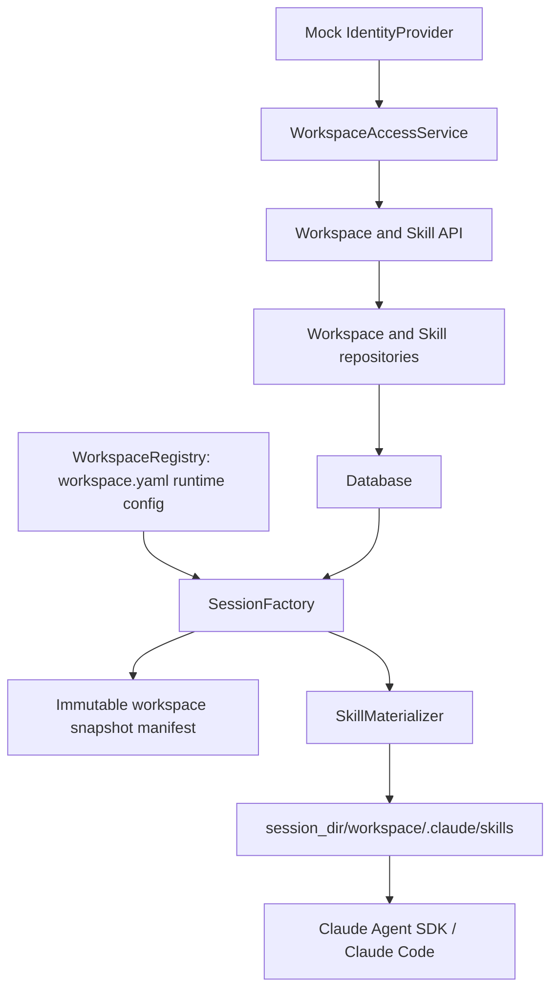

# Workspace Skill Management Design

**Date:** 2026-07-24

## Goal

Replace the current server-wide Skill directory model with Workspace-scoped
Skill management that can support personal and team spaces without leaking
Skills between them.

The first release deliberately follows Multica's simpler mutable-Skill model:
each Workspace owns one current copy of each Skill, identified by a stable ID
and protected by a deterministic bundle hash. New Sessions capture an immutable
copy of the enabled bundles. User-visible releases, cross-Workspace version
installation, upgrades, and rollback are deferred.

## Confirmed Product Decisions

- A personal space and a team space are both Workspaces.
- A Skill belongs to exactly one Workspace in the first release.
- The Workspace's enabled Skill set applies to all new Sessions in that
  Workspace.
- A Session created after this migration keeps the exact Skill bundles present
  when it was created. Later Skill edits, disabling, archiving, or deletion do
  not change that Session. Legacy symlinked Sessions are covered by the explicit
  compatibility limitation below.
- Only Workspace owners and admins can create, import, edit, copy, enable,
  disable, or archive Skills. Members can view and use enabled Skills.
- The authorization boundary is designed for company SSO, but the first release
  uses a small mock identity provider.
- Creating and editing in the UI, uploading `.skill`/`.zip` bundles, and a
  one-time local import are in scope. Git URL import and synchronization are not.
- Existing local Skills are imported into the mock user's personal Workspace.
- Cross-Workspace sharing is a copy operation in the first release. The copy is
  a new, independent Skill and starts disabled in the target Workspace.
- The long-term direction is immutable releases (`v1`, `v2`, ...) and explicit
  Workspace installations, but those entities and workflows are not part of
  this release.

## Current-State Constraints

The application currently discovers server filesystem Workspace directories
and validates `workspace.yaml`. A manifest names Skills from either a local
`.claude/skills` directory or a server-wide external Skill root. Session
creation copies local Skills or creates symbolic links to external Skills under
the Session's `.claude/skills` directory.

The database currently stores Sessions, Turns, Messages, and Attachments only.
`sessions.workspace_snapshot_json` and `workspace_snapshot_hash` already provide
a place to persist the normalized Session configuration, while `session_dir`
identifies the isolated filesystem used for execution.

This design keeps the current Claude Agent SDK execution contract. Claude Code
still discovers ordinary files under the Session's `.claude/skills` directory;
only the management and materialization source changes.

## Approaches Considered

### Selected: database management plane, filesystem execution plane

Users, Workspace membership, roles, Skill metadata, `SKILL.md`, and supporting
files live in the database. Session creation reads the authorized bundles and
materializes regular files into an isolated Session directory.

This gives the application a real tenant and authorization boundary while
retaining Claude Code's native Skill discovery behavior.

### Rejected: Workspace YAML and directories as the complete management model

Separate directories would be faster to prototype, but filesystem presence is
not a sufficient authorization model. Concurrent editing, role enforcement,
cross-Workspace copying, auditability, and future version installation would
all become directory conventions rather than explicit product behavior.

### Deferred: full Skill artifact registry

Immutable releases, an installation table, upgrade notices, rollback, and Git
source synchronization are appropriate later, but would make the first release
substantially larger without improving the core Workspace isolation boundary.

## Architecture

The feature is divided into a management plane and an execution plane.



### `IdentityProvider`

`IdentityProvider.resolve(request)` returns an `IdentityContext` containing a
stable external subject and display name. Authorization code depends only on
this interface.

The first implementation returns a configured mock user. A seed fixture maps
that subject to a personal Workspace and optional team memberships. A future
SSO adapter can validate a gateway header or token and upsert the same user
identity without changing Skill or Session services.

### `WorkspaceAccessService`

This is the single authorization entry point. It resolves the user's role for
a Workspace and exposes explicit checks such as `require_member`,
`require_manager`, and `require_owner`.

Handlers and repositories do not infer authorization from a path, a submitted
Workspace ID, or the existence of a Skill row. Resource lookup for an
unauthorized Workspace returns the same not-found response as a missing
resource to avoid tenant enumeration.

### `SkillService` and repository

`SkillService` owns bundle validation, metadata parsing, hash calculation,
optimistic concurrency, import, copy, enable/disable, and archive behavior. The
repository provides Workspace-scoped reads and atomic writes. No handler can
fetch a Skill by ID without also applying its Workspace authorization boundary.

### `WorkspaceRegistry` and synchronization

`workspace.yaml` remains authoritative in the first release for non-Skill
runtime configuration such as the Workspace directory, model configuration,
MCP configuration, instructions, and seed files. A synchronization step mirrors
its validated ID, name, and normalized runtime configuration into the
`workspaces` table for listing and membership. Because the current manifest has
no personal/team field, the mock membership fixture supplies `kind` in the first
release; a later user-center adapter owns that classification.

The YAML Skill list is used only by the one-time migration. After that
migration, the database is the sole source for Skills included in new Sessions.

### `SessionFactory` and `SkillMaterializer`

Session creation combines the validated `WorkspaceRegistry` entry with the
database's currently enabled Skill bundles. It builds a snapshot manifest,
writes a temporary Session directory, safely materializes ordinary files, and
atomically renames the directory before inserting the Session record.

Turns and resumed Sessions use the existing `session_dir`; they never
rematerialize from the current Skill rows.

## Data Model

### `users`

| Column | Meaning |
|---|---|
| `id` | Internal stable ID |
| `external_subject` | Unique SSO/mock subject |
| `display_name` | User-facing name |
| `provider` | `mock` initially, later an SSO provider key |
| timestamps | Creation and last update |

### `workspaces`

| Column | Meaning |
|---|---|
| `id` | Existing string Workspace ID, preserving Session compatibility |
| `name` | Display name |
| `kind` | `personal` or `team` |
| `config_json` | Last validated mirror of non-Skill `workspace.yaml` configuration |
| timestamps | Creation and last synchronization |

`config_json` is a normalized mirror, not an independently editable runtime
configuration source in this release.

### `workspace_members`

The primary key is `(workspace_id, user_id)`. `role` is one of `owner`,
`admin`, or `member`. A personal Workspace has exactly one owner and no other
members. A team Workspace has exactly one owner and may have admins and members.

### `skills`

| Column | Meaning |
|---|---|
| `id` | UUID, stable across edits |
| `workspace_id` | Owning Workspace |
| `name` | Parsed canonical Skill name |
| `description` | Parsed frontmatter description for lists and `/` autocomplete |
| `content` | UTF-8 root `SKILL.md` content |
| `enabled` | Whether new Sessions include the Skill |
| `bundle_hash` | Deterministic SHA-256 of the complete current bundle |
| `config_json` | Origin and copy lineage metadata |
| `created_by` | Creating/importing user |
| `archived_at` | Null for active Skills; set instead of hard deletion |
| timestamps | Creation and last update |

`(workspace_id, name)` is unique among non-archived Skills. The implementation
must define the SQLite-compatible uniqueness mechanism explicitly in the
migration; archived names may be reused.

### `skill_files`

The primary key is `(skill_id, path)`. Each row stores `content_blob`,
`mime_type`, `size_bytes`, and the file's SHA-256. The root `SKILL.md` is stored
in `skills.content`, not duplicated in `skill_files`.

BLOB storage intentionally supports templates, images, and other binary Skill
assets instead of limiting supporting files to UTF-8 text.

### Existing `sessions`

After Workspace rows are backfilled, `sessions.workspace_id` becomes a
Workspace reference. No separate Session-Skill table is necessary in the first
release.

`workspace_snapshot_json` is extended with a versioned Skill manifest:

```json
{
  "schema_version": 2,
  "workspace": {},
  "skills": [
    {
      "id": "skill-uuid",
      "name": "brainstorming",
      "description": "Clarify goals before creative work.",
      "bundle_hash": "sha256:...",
      "files": [
        {"path": "references/checklist.md", "sha256": "sha256:...", "size_bytes": 1234}
      ]
    }
  ]
}
```

The full Skill bytes are not duplicated in the Session row. The immutable
regular files under `session_dir` are the content snapshot; the JSON is the
auditable manifest. `workspace_snapshot_hash` covers the normalized complete
manifest, including the ordered Skill manifests.

## Bundle Contract

A valid package contains exactly one root `SKILL.md`. Its YAML frontmatter must
contain valid `name` and `description` strings. The server treats frontmatter as
canonical: submitted metadata that disagrees with `SKILL.md` is rejected.

The bundle hash is calculated from a version marker, canonical name,
description, exact `SKILL.md` bytes, and supporting files sorted by normalized
path. Each file contributes its path, length, SHA-256, and exact bytes. The
Workspace ID and Skill ID are not included, so an unchanged copy has the same
content hash.

Allowed paths are normalized relative POSIX paths. Empty paths, absolute paths,
`.` or `..` components, backslashes, NUL bytes, duplicate normalized paths,
symbolic links, hard links, devices, and other non-regular archive entries are
rejected. Extraction never writes outside a temporary directory.

Default configurable limits are:

- 10 MiB per supporting file;
- 50 MiB for the uncompressed complete bundle;
- 200 supporting files;
- bounded frontmatter parsing.

## Permissions

| Capability | Owner | Admin | Member |
|---|---:|---:|---:|
| List and view Skills and usage descriptions | Yes | Yes | Yes |
| Use enabled Skills in Sessions | Yes | Yes | Yes |
| Create, edit, upload, and bulk import | Yes | Yes | No |
| Enable, disable, and archive | Yes | Yes | No |
| Copy to another Workspace | Yes | Yes | No |
| Manage members and roles | Yes | No | No |

Copy requires owner/admin access in both the source and target Workspaces. The
copy receives a new Skill ID, records `source_skill_id` and `source_hash` in
`config_json`, and starts disabled. Later edits never propagate between copies.

## API Surface

- `GET /api/me`
- `GET /api/workspaces`
- `GET /api/workspaces/{workspace_id}/skills`
- `POST /api/workspaces/{workspace_id}/skills`
- `GET /api/skills/{skill_id}`
- `PATCH /api/skills/{skill_id}` with `expected_hash`
- `DELETE /api/skills/{skill_id}` with archive semantics
- `POST /api/workspaces/{workspace_id}/skills/import` as multipart upload
- `POST /api/skills/{skill_id}/copy` with `target_workspace_id`
- existing `GET /api/sessions/{session_id}/skills`

Workspace routes return only resources for which the current user has the
required membership. Mutation handlers enforce authorization server-side even
when the UI hides or disables their controls.

The active-Session `/` autocomplete must continue to call the Session Skills
endpoint. It reads the Session snapshot, not the current Workspace rows, so it
cannot suggest a Skill unavailable to that Session. A brand-new conversation
uses the current Workspace's enabled list until its Session is created.

## Core Flows

### Create or edit a Skill

1. Resolve the current identity and require owner/admin access.
2. Validate metadata, package limits, paths, frontmatter, and files.
3. Calculate file hashes and the bundle hash.
4. For an edit, compare `expected_hash` with the current row.
5. Replace the Skill content and complete file set in one transaction.
6. Return the new summary and hash. Existing Sessions remain untouched.

If `expected_hash` is stale, return `409 skill_changed`. The UI retains the
user's draft and offers refresh; it never silently overwrites another admin's
save.

### Import `.skill` or `.zip`

1. Stream the upload with compressed and uncompressed size limits.
2. Parse into an in-memory validated bundle without extracting untrusted paths.
3. Return `409 skill_name_conflict` for an existing active name; no implicit
   overwrite occurs.
4. Create the Skill and files atomically. New manual imports start disabled.

Bulk local migration imports each Skill in an independent transaction and
returns a structured created/skipped/conflict/failed result for every source.
One malformed Skill does not block the other Skills.

### Copy a Skill

1. Require manager access to source and target Workspaces.
2. Read and validate the source bundle inside a consistent transaction.
3. Reject a target name conflict.
4. Create an independent disabled Skill with a new ID and origin lineage.

### Create a Session

1. Require Workspace membership.
2. Read the validated runtime configuration and all enabled active bundles in a
   consistent database view.
3. Build the versioned manifest and `workspace_snapshot_hash` from those exact
   bytes.
4. Write instructions, seed files, attachments/output directories, and regular
   Skill files into a temporary Session directory.
5. Verify every materialized path and hash, then atomically rename the directory.
6. Insert the Session with its manifest and final directory.
7. If the database write fails, remove the final directory. If materialization
   fails, remove the temporary directory and do not insert a Session.

The runtime and all later Turns use only that Session directory.

## UI Design

The application header keeps the Workspace selector as the global context and
adds a personal/team badge. The existing Skill-count badge opens a Workspace
Skill management view.

The Skill list shows:

- name;
- the short frontmatter description, truncated to one line with a full tooltip;
- origin (`local import`, `personal creation`, or `Workspace copy`);
- enabled state;
- last update;
- manager actions appropriate to the current role.

The view provides `New Skill`, `Import .skill/.zip`, and `Copy to Workspace`
actions for managers. The detail view edits `SKILL.md`, lists supporting files,
shows the current hash, and warns when an optimistic-concurrency conflict occurs.

The `/` autocomplete preserves the compact Codex-style name-and-description row
and bounded, independently scrollable list. It filters only the Skills available
to the active Session, or the current Workspace when composing a new Session.

## Error Handling

Errors use stable application codes:

| Status | Code | Behavior |
|---:|---|---|
| 401 | `identity_missing` | Identity provider did not resolve a user |
| 404 | `workspace_not_found` / `skill_not_found` | Missing or unauthorized resource |
| 409 | `skill_name_conflict` | Active duplicate name in target Workspace |
| 409 | `skill_changed` | Optimistic hash mismatch |
| 413 | `skill_bundle_too_large` | Compressed/uncompressed limits exceeded |
| 422 | `invalid_skill_bundle` | Invalid package, frontmatter, path, entry, or hash |

Validation errors include safe field/path details but never server filesystem
roots or content from another Workspace. Unexpected storage failures return the
existing generic internal error shape and are logged with request, user, and
Workspace identifiers.

## Migration and Compatibility

The application introduces ordered Alembic migrations. Production startup runs
approved migrations before serving requests; `create_all` is restricted to
isolated tests or replaced by migration-based test setup.

The first migration sequence:

1. Creates user, Workspace, membership, Skill, and Skill-file tables.
2. Synchronizes all currently valid registry Workspaces into the database.
3. Seeds the configured mock user and membership fixture.
4. Imports each existing Workspace manifest's named Skills as enabled managed
   copies in that Workspace, preserving current new-Session behavior.
5. Imports the complete configured local Skill root into the mock user's
   personal Workspace. Identical name/hash pairs are skipped; different content
   is reported as a conflict and never overwritten automatically.
6. Marks the bootstrap complete so later startups do not re-import YAML Skill
   lists.

Existing Session rows and directories are not rewritten. They remain loadable.
Legacy Sessions that contain external Skill symbolic links retain their legacy
live-link behavior because the original historical bytes cannot be recovered;
the immutable-bundle guarantee applies to Sessions created after this migration.
The UI and API continue to read their persisted legacy snapshots compatibly.

## Verification and Acceptance

### Unit tests

- deterministic bundle hash independent of file enumeration order;
- per-file hashes and binary round trips;
- frontmatter normalization and metadata mismatch rejection;
- archive path, entry type, count, and size defenses;
- mock identity resolution and the complete role matrix;
- optimistic concurrency and archive-name uniqueness behavior.

### Repository and API integration tests

- Workspace-scoped queries cannot return another Workspace's Skill;
- unauthorized and missing resources have indistinguishable responses;
- member mutations are rejected while member use succeeds;
- create/edit replaces files atomically and conflicts preserve prior content;
- copy creates an independent, disabled bundle with lineage;
- batch import reports partial success without partial rows per Skill;
- migration is idempotent and preserves existing Session rows.

### Session integration tests

- only enabled active Skills are materialized as regular files;
- disabling or archiving excludes a Skill from new Sessions;
- editing after Session creation does not change its files, hash, or autocomplete;
- a later Session receives the new hash and bytes;
- binary supporting files are byte-identical;
- materialization and database failures leave no temporary directory, final
  orphan directory, or Session row;
- legacy Sessions still load after migration.

### Frontend and browser tests

- Workspace switching replaces the management list and new-Session candidates;
- an existing Session's candidates remain pinned to its snapshot;
- member controls are absent or disabled while server enforcement remains tested;
- conflict feedback preserves unsaved editor content;
- a catalog of at least 77 descriptions scrolls to the final option with wheel
  and keyboard navigation at the regression viewport size;
- end-to-end flows cover personal import, `/` selection, team copy, admin enable,
  member use, Skill edit, and old-Session resume.

## Non-Goals

- immutable user-visible releases and version history;
- team installation, upgrade notices, rollback, or automatic propagation;
- Git URL import or source synchronization;
- a public/private Skill marketplace;
- real company SSO protocol integration;
- per-Agent Skill bindings;
- changes to MCP management;
- retroactively reconstructing immutable bytes for legacy symlinked Sessions.

## Future Extension

The current `skills` row becomes the editable draft/latest representation. A
future `skill_releases` table can store immutable `v1`, `v2`, ... bundles, while
`workspace_skill_installations` pins a Workspace to a release. Existing bundle
hashes, copy lineage, Session manifests, materialization, and authorization
boundaries remain usable without redesigning the execution plane.
