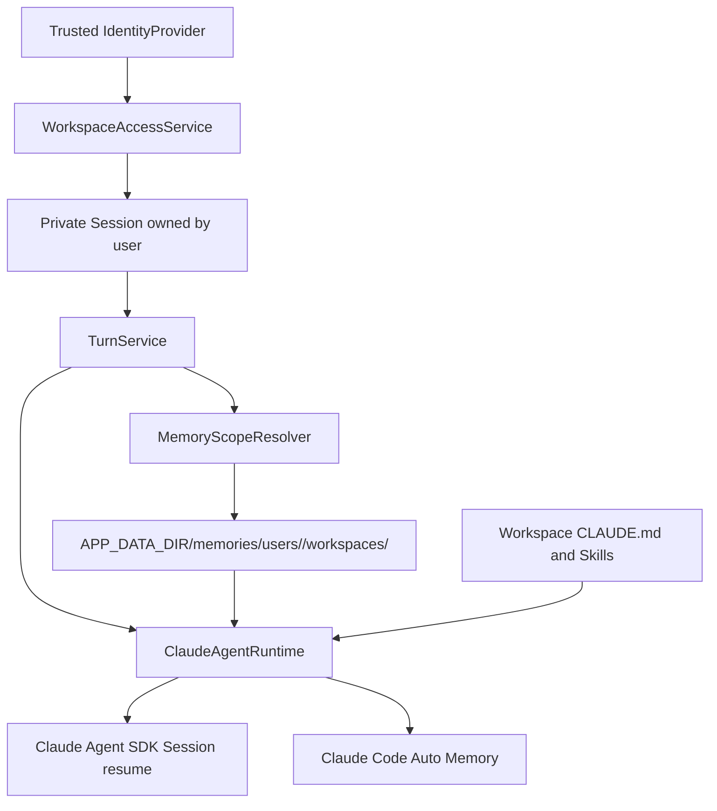

# SDK-Native Workspace Memory Design

**Date:** 2026-07-26

## Goal

Add useful cross-Session personal memory to the first server-hosted release
without building a custom memory engine or introducing a vector database,
separate memory service, or another Agent framework.

The selected design reuses two capabilities already present in the Claude Agent
SDK runtime:

- Session persistence and `resume` provide short-term continuity inside one
  web Session.
- Claude Code Auto Memory provides automatically selected long-term notes
  across Sessions.

The application owns only the tenant boundary: it assigns each authenticated
user a stable Auto Memory directory inside each Workspace and ensures that no
other user or Workspace can select or access that directory.

## Confirmed Product Decisions

- A personal space and a team space in the data-center product each map to one
  application Workspace.
- A Session belongs to one Workspace and one creating user.
- Sessions are private to their creator, including in a team Workspace.
- Session publishing and sharing are not part of this release.
- Personal memory is recognized and written automatically by Claude Code Auto
  Memory.
- Personal memory is isolated by both user and Workspace. The same user does
  not automatically carry memories from one Workspace into another in the
  first release.
- Dynamic shared team memory is not part of this release. Shared Workspace
  guidance continues to use the existing `CLAUDE.md`, Skills, and business MCP
  services.
- The first release remains a single application instance using SQLite and one
  mounted persistent volume.
- PostgreSQL, object storage, Redis, Mem0, Graphiti, Letta, vector search, and a
  dedicated memory administration UI are deferred.

## Non-Goals

This release does not provide:

- semantic search across all memories;
- cross-Workspace personal memory;
- automatically writable team memory;
- memory sharing, approval, publishing, or moderation;
- a custom memory extraction prompt or custom conflict-resolution algorithm;
- a database representation of each memory fact;
- multi-instance application deployment;
- migration of old Session-local Auto Memory into the new shared scope.

These omissions are intentional. They preserve a narrow first release and
leave a clear upgrade path to Mem0 or another dedicated memory service if file
memory becomes insufficient.

## Current State

The application currently stores users, Workspace membership, Sessions, Turns,
Messages, Attachments, and Skills in SQLite by default. A Session records its
Workspace but not its creator. Workspace membership therefore currently grants
access to every Session in that Workspace.

Each new Session is materialized under:

```text
APP_DATA_DIR/sessions/<session-id>/
├── workspace/
└── claude-config/
```

The runtime passes the Session-specific `claude-config` directory through
`CLAUDE_CONFIG_DIR`. It persists the returned Claude Session ID and passes it
back through `ClaudeAgentOptions.resume` on later Turns.

This already provides same-Session continuity. It does not provide cross-Session
memory because Auto Memory currently resolves inside each Session's isolated
configuration directory.

The installed SDK exposes `ClaudeAgentOptions.settings` as the path to an
additional settings JSON file, and its bundled Claude Code runtime supports
`autoMemoryDirectory`. That setting can redirect only Auto Memory while leaving
the existing Session transcript isolation unchanged.

## Approaches Considered

### Selected: SDK-native Auto Memory with an application-owned directory

For every Turn, the server derives a stable directory from the authenticated
user and authorized Workspace, writes that directory into a server-controlled
settings file, and passes the file path through the SDK settings option. Claude
Code performs memory selection, writing, organization, and recall.

This introduces no new memory database, embedding model, vector index, or
memory extraction call. It preserves the current Claude Agent SDK architecture
and can be replaced behind a small application interface later.

### Deferred: Mem0 OSS

Mem0 is the preferred upgrade when the product needs semantic retrieval,
structured memory APIs, larger memory volumes, or governed shared memory. It
can be integrated as an in-process Python library or a self-hosted service and
supports scoped identifiers plus automatic extraction.

It is not selected now because a self-hosted deployment still adds an
extraction LLM call, an embedding model, a vector store such as Qdrant or
PostgreSQL with pgvector, operational configuration, and another persistence
boundary.

### Rejected for the first release: Graphiti or Letta

Graphiti adds a temporal knowledge graph and a graph database. Letta provides a
broader stateful Agent runtime. Both solve substantially larger problems and
would overlap with or reshape the current Claude Agent SDK runtime.

### Rejected: custom memory tables and extraction pipeline

A custom `memory_items` schema would make scope and auditing explicit but would
also require extraction, deduplication, conflict resolution, retrieval,
ranking, deletion semantics, and administration. That is the wheel this first
release is intended to avoid building.

## Architecture



The design introduces two small application components, not a memory engine:

- `MemoryScopeResolver` derives and validates the directory for an authorized
  `(user_id, workspace_id)` pair.
- `MemoryScopeLockRegistry` prevents concurrent Turns from writing the same
  Auto Memory files in the single-process first release.

## Identity and Authorization

The memory namespace must use the server-resolved `IdentityContext.user_id` and
the Workspace ID obtained from the authorized Session. Neither value may come
from the model, prompt text, query parameters added solely for memory, or an
untrusted client header.

The future data-center integration replaces `MockIdentityProvider` with a
provider that validates the platform's signed token or trusted gateway context.
It maps a stable external subject to the application's internal user ID and a
stable external space ID to the application's internal Workspace ID.

`SessionRecord` gains a non-null `created_by` foreign key. All Session list,
read, rename, delete, attachment, message, file, Skill-catalog, Turn, and stream
operations require both Workspace membership and Session ownership. A team
Workspace member cannot enumerate or access another member's Sessions.

Because Alembic runs before the configured identity is synchronized, the
schema migration assigns existing Sessions to one reserved legacy-owner row.
During the same application startup, immediately after Workspace identity
synchronization and before requests are served, the service reassigns those
Sessions to the configured bootstrap user. No sharing state or publication
column is added.

## Memory Scope and Filesystem Layout

The stable layout is:

```text
APP_DATA_DIR/
├── app.db
├── sessions/
│   └── <session-id>/
│       ├── workspace/
│       └── claude-config/
└── memories/
    └── users/
        └── <opaque-user-key>/
            └── workspaces/
                └── <opaque-workspace-key>/
                    ├── MEMORY.md
                    └── <topic-files-created-by-Claude>.md
```

The resolver hashes the trusted internal user and Workspace IDs into stable,
opaque path components. It joins those components beneath
`APP_DATA_DIR/memories`, rejects symbolic-link ancestors, resolves the result,
and rejects it unless it remains inside that root. It creates directories with
owner-only permissions where supported. Raw IDs and absolute paths are never
returned by an API.

The scope deliberately includes `workspace_id`. This prevents a preference or
fact learned while working with one team's confidential data from appearing in
another personal or team Workspace. A later release may add a separate global
profile after it has explicit classification and user controls.

## SDK Configuration

`RuntimeRequest` gains trusted memory-scope information supplied by
`TurnService`; the browser does not submit it. `ClaudeAgentRuntime` atomically
writes a server-controlled settings file equivalent to:

```json
{
  "autoMemoryEnabled": true,
  "autoMemoryDirectory": "/absolute/app-data/memories/users/u/workspaces/w"
}
```

The file lives under the Session's private `claude-config` directory, is written
with owner-only permissions where supported, and its path is passed through
`ClaudeAgentOptions.settings`. The existing options remain unchanged:

- `resume` continues to use the Session's persisted Claude Session ID;
- `cwd` remains the isolated Session workspace;
- `CLAUDE_CONFIG_DIR` remains Session-specific;
- `setting_sources=["project"]` continues loading the materialized Workspace
  instructions and Skills.

The memory directory is not placed in project settings. Claude Code accepts
`autoMemoryDirectory` only from user/policy settings or the explicit
`--settings` layer, preventing a checked-in project from redirecting memory
writes.

## Turn Lifecycle

For each Turn:

1. Resolve the authenticated identity.
2. Load the Session and verify `created_by` matches that identity.
3. Verify the user remains a Workspace member.
4. Derive and validate the personal Workspace memory directory.
5. Acquire the in-process lock for `(user_id, workspace_id)`.
6. Preflight that the directory exists and is writable.
7. Atomically write the private settings file and start the Claude Agent SDK
   with that file, the stable Auto Memory directory it names, and the existing
   Session resume ID.
8. Let Claude Code load relevant Auto Memory and decide whether the completed
   work contains information worth remembering.
9. Persist the returned Session ID and ordinary page events as today.
10. Release the memory-scope lock after the Agent process exits.

The lock means two Sessions owned by the same user in the same Workspace do not
execute simultaneously. Different users or different Workspaces may execute in
parallel. This is an acceptable first-release trade-off that avoids concurrent
Markdown writes without introducing a distributed lock.

## Team Knowledge Boundary

Team Workspace guidance remains explicit and curated:

- `CLAUDE.md` contains Workspace-wide instructions and conventions.
- Workspace Skills contain reusable domain workflows and reference material.
- Business MCP services provide live data and governed business actions.

Auto Memory never points at a team-shared directory in this release. Therefore
a fact from a private Session cannot silently become visible to other team
members. Dynamic team memory can be designed separately with confirmation,
audit, and deletion rules when there is a demonstrated need.

## Storage and Deployment

The first release supports one application instance. `APP_DATA_DIR` must be a
mounted persistent volume; container-local ephemeral storage is invalid.

SQLite remains the source of truth for application records. The persistent
volume remains the source of truth for Session runtime files and Auto Memory.
Backups must capture the whole `APP_DATA_DIR` consistently rather than copying
only `app.db`.

The service health check should report whether the data directory and memory
root are writable. A missing or read-only memory mount is a startup/readiness
failure rather than silently starting with disposable memory.

Multi-instance deployment is explicitly unsupported in this release. Before
horizontal scaling, the application must move relational data to PostgreSQL,
mirror Claude transcripts through SDK `SessionStore`, move memory to shared
storage or a memory service, and replace the in-process memory lock with a
distributed concurrency strategy.

## Security Boundary

Auto Memory files are plaintext. Filesystem permissions and runtime isolation
are therefore part of the security model, not optional operational details.

The implementation must:

- derive memory paths exclusively from trusted internal identity and Workspace
  records;
- reject path traversal and any resolved path outside the memory root;
- avoid logging memory content or absolute tenant paths;
- prevent users from accessing Sessions they did not create;
- ensure an Agent execution can access only its Session workspace and its
  current memory scope;
- never mount another user or Workspace memory directory into that execution;
- exclude credentials, host configuration, and other tenant directories from
  Agent filesystem access.

The current MVP's instruction to work only inside the Session workspace is not
a sufficient hostile multi-tenant sandbox. Verified filesystem/container
isolation is a release prerequisite before exposing the application to mutually
untrusted data-center users. If that isolation is unavailable, Auto Memory must
remain disabled in the shared deployment.

## Failure Handling

- An invalid or escaping memory path fails the Turn with an internal security
  error before the Agent starts.
- A missing directory is created during preflight.
- An unwritable memory root makes application readiness fail and prevents new
  Turns from starting.
- A failure to create the settings file or start the SDK with it returns a
  stable `memory_unavailable` error without retrying under the default host
  memory.
- A Turn interrupted after Claude writes memory does not roll the Markdown back;
  Auto Memory is an Agent runtime artifact and may reflect useful partial work.
- Existing Session-local memory directories are retained but not merged into
  the new scope, avoiding accidental cross-Session contamination.

## User Experience

There is no dedicated memory page in the first release. Users can use ordinary
language:

- "记住以后这个 Workspace 的 SQL 都使用 Trino 语法。"
- "你记得我在这个 Workspace 的哪些偏好吗？"
- "忘记我之前关于报告语言的偏好。"

Claude Code performs the corresponding Auto Memory operations. A future memory
page may expose review, editing, deletion, provenance, and scope promotion, but
those workflows are not needed to validate the first-release value.

The UI should show a small, non-interactive indicator that personal Workspace
memory is enabled. It must not claim that team memory or semantic retrieval is
available.

## Migration

The database migration and startup ownership handoff add
`sessions.created_by`:

1. Add it as nullable.
2. Create a reserved legacy-owner user when existing Sessions require it.
3. Backfill existing rows to that reserved user.
4. Add the foreign key/index required by supported databases and enforce
   non-null.
5. After identity and Workspace synchronization, atomically reassign reserved
   legacy ownership to the configured bootstrap user before serving requests.

On first use, memory directories are created lazily. No bulk filesystem
migration runs. Existing per-Session Claude transcripts and `resume` IDs remain
valid because their directories and SDK options do not change.

## Verification

### Unit tests

- Memory paths are deterministic for a user and Workspace.
- User or Workspace identifiers cannot escape the memory root.
- The generated private settings file contains the correct absolute
  `autoMemoryDirectory`; SDK options reference that file and keep the
  Session-specific `CLAUDE_CONFIG_DIR` and `resume` value.
- Session creation records the authenticated creator.
- Session queries always filter by creator as well as membership.
- The memory-scope lock serializes same-user/same-Workspace Turns while leaving
  other scopes independent.

### Integration tests

- Two Sessions for the same user and Workspace receive the same Auto Memory
  directory and different Claude transcript directories.
- The same user in two Workspaces receives different memory directories.
- Two users in the same team Workspace receive different memory directories.
- A team member cannot list, read, rename, delete, attach to, or run a Turn in
  another member's Session.
- A read-only or unavailable memory mount fails readiness and new Turns with a
  stable error.
- Existing Session resume behavior remains intact.

### Live verification

Using the real SDK runtime:

1. Create Session A, state a stable preference, and ask Claude to remember it.
2. Create Session B as the same user in the same Workspace and verify recall.
3. Create a Session in another Workspace and verify the preference is absent.
4. Use a second user in the original team Workspace and verify both the Session
   and memory remain inaccessible.
5. Restart the service and verify Session resume and Auto Memory recall still
   work from the mounted persistent volume.

## Upgrade Triggers

Revisit Mem0 or another dedicated memory service when at least one of these is
true:

- memory files become too large for reliable native recall;
- users require semantic search across many memories;
- cross-Workspace global profiles become a product requirement;
- dynamic team memory requires approval, provenance, versions, and moderation;
- memory must be queried independently of Claude Code;
- the application must run multiple instances;
- product or regulatory requirements demand structured memory audit and
  deletion.

Until one of those triggers is demonstrated, SDK-native Auto Memory is the
smallest architecture that satisfies the confirmed first-release requirements.
