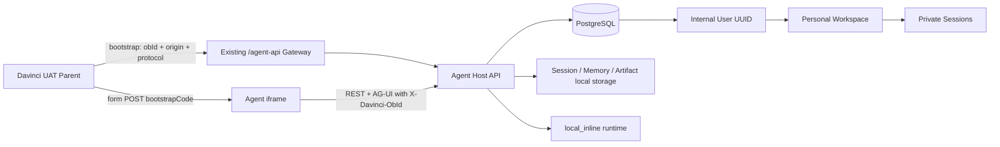
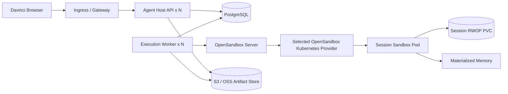

# Davinci 用户 Workspace 与 Session 两期设计

## 文档状态

- 日期：2026-08-12
- 分支：`codex/identity-workspace-session`
- 状态：架构方向和一期 OBID 简化方案已获用户确认；本文等待用户最终审阅
- 一期目标环境：Davinci UAT + 单机 Agent Host
- 二期目标环境：多副本 Agent Host + OpenSandbox Kubernetes

## 1. 结论

采用以下稳定产品模型：

```text
一个 Davinci 用户
  -> 一个 Personal Product Workspace
       -> 多个私有 Session
```

各层职责固定为：

| 层级 | 职责 | 是否等于物理目录或容器 |
|---|---|---|
| User | 外部用户与内部稳定 UUID 的映射 | 否 |
| Product Workspace | 权限、Skill、MCP 声明、配置和个人长期记忆的逻辑边界 | 否 |
| Session | 对话历史、工作目录、附件、输出和 Claude resume 状态的隔离边界 | 是，每个 Session 有独立运行目录 |
| Sandbox | 执行 Session Turn 的可回收计算资源 | 否，按 Session 按需创建和复用 |

一期为当前 UAT 选择裸 OBID 身份模式，以最小代码建立真实用户隔离。一期明确不是强安全认证；二期把身份提供者替换为可信签名身份时，继续解析到同一内部用户 UUID，因此身份和产品主键不重映射。Session 物理文件仍需从本机迁移到 PVC/对象存储。

持久状态与计算分离。PostgreSQL 是身份映射、Workspace、Session、Turn、事件和并发状态的权威；Session 文件、Memory 和 Artifact 通过应用端口访问；Sandbox 可以销毁和重建。

## 2. 第一性原理和范围

### 2.1 设计原则

1. **身份、所有权、执行位置是三个不同问题。** OBID 只标识 UAT 用户，内部 UUID 才是产品资源主键。
2. **Workspace 是逻辑配置域，不是共享可写目录。** 多个 Session 共享配置和记忆，不共享工作目录。
3. **Session 是最小可恢复单元。** 对话、Claude transcript、附件和产物均能独立恢复。
4. **计算可回收，持久数据不可依赖容器 rootfs。**
5. **同一可变状态同一时间只有一个写者。** 一个 Session 只运行一个 Turn；一个 `user + workspace` Memory 同时只允许一个写 Turn。
6. **一期只实现 UAT 需要的能力。** 不为二期预建调度器、Redis、RWX 文件系统、自研 Memory 或自研 Sandbox 平台。
7. **二期通过适配器替换基础设施，不改变产品 ID 和 API 语义。**

### 2.2 一期非目标

- 不把裸 OBID 宣称为生产级认证。
- 不支持公网或不受信网络中的多租户隔离。
- 不做团队 Workspace、Session 分享或转让。
- 不做 Workspace 共享可写根目录。
- 不给每个 Workspace 创建常驻容器。
- 不为每个 Session 创建永久容器。
- 不引入 Kubernetes、S3/OSS、Redis、etcd、NFS/RWX 或自定义调度器。
- 不重写 Claude Code Auto Memory。
- 不为用户级 MCP 自建 Token 签发系统。

## 3. 当前代码基线与真实缺口

当前 Agent Host 已有可复用能力：

- `users`、`identity_mappings`、`workspaces`、`workspace_members`、`sessions`、`turns`、`attachments` 和 `turn_events` 数据模型。
- Session、Turn、Attachment 已按创建者校验，跨用户资源隐藏为 404。
- Session 已物化到 `APP_DATA_DIR/sessions/<session_id>/workspace`，含 `attachments/`、`outputs/` 和独立 `claude-config/`。
- Claude Auto Memory 已按 `(internal_user_id, workspace_id)` 隔离。
- Session Sandbox、Turn Attempt、Worker Heartbeat 和 PostgreSQL Memory lease 已存在，可供二期复用。
- OpenSandbox Docker adapter 已按 Session volume 与 Memory volume 建模。

当前代码支持 SQLite 和 PostgreSQL；这不代表 UAT 已经在使用 PostgreSQL。一期上线前必须显式配置外部 PostgreSQL，并将数据库方言作为启动 Gate，禁止把 Agent Host 本机 SQLite 当成可迁移的 UAT 权威。

需要补齐的缺口：

1. iframe bootstrap 只绑定 Origin 和协议，所有 UAT 用户仍由全局 Mock identity 表示。
2. Product Workspace ID 与静态 `WORKSPACES_ROOT/<id>/workspace.yaml` 强耦合，动态个人 Workspace 无法创建 Session。
3. 个人 Workspace 只在 Mock 启动时为固定用户同步，不支持首次访问幂等创建。
4. iframe 的 Session localStorage key 没有用户和 Workspace 命名空间。
5. 当前本地 bootstrap store 和部分前端工具等待状态在进程内，不能直接用于真正的多副本部署。
6. 附件和生成物主要依赖本机文件，尚无可替换的 Artifact 存储权威。

## 4. 稳定领域模型

### 4.1 User

内部用户 ID 始终使用随机 UUID。外部身份通过映射表解析：

```text
issuer = "davinci"
subject = "obid:<normalized-obid>"
  -> users.id = internal UUID
```

`obId` 不直接作为数据库主键、目录名、PVC 名或对象存储 key。二期可信认证仍使用相同 `issuer + subject`，只增加来源校验，不改变映射结果。

现有 `IdentityRepository` 将 `provider` 和 opaque subject 前缀写死为 `oidc`。实施时需把该 repository 泛化为 provider-neutral：映射唯一键仍是 `(issuer, subject)`，`UserRecord.provider` 和 opaque external subject 按实际 provider 生成，不能给 OBID 用户伪装成 OIDC 用户。

OBID 规范化规则：

- 将 OBID 视为 opaque identifier，不参与数值运算；整数输入只做字符串化，字符串输入只去除首尾空白，不删除前导零。
- 规范值只允许 `[A-Za-z0-9._-]{1,64}`，拒绝空值、控制字符和其他格式。
- 日志默认记录内部 `user_id`；需要排障时只记录 OBID 的短哈希，不记录完整值。

### 4.2 Product Workspace

每个内部用户幂等拥有一个 `kind=personal` 的 Workspace：

```text
WorkspaceRecord.id          = opaque UUID
WorkspaceRecord.owner_user_id = internal user UUID
WorkspaceRecord.template_id = "example" 等静态模板 ID
```

数据库通过局部唯一约束保证每个用户最多一个 personal Workspace。`workspace_members` 继续保存 owner membership，使未来 personal/team 权限查询使用同一 AccessService。

`template_id` 指向只读静态模板。模板提供：

- 基础 `CLAUDE.md`
- 初始 Skills
- MCP server 声明和候选 `allowed_tools`
- 模型与运行策略默认值

不为每个用户复制 `workspace.yaml` 或整个模板目录。

### 4.3 Session

一个 Workspace 可以创建多个 Session。每个 Session：

- 归属于一个 `workspace_id`；
- 归属于一个 `created_by`；
- 默认只有创建者可以查看和操作；
- 创建时保存 Workspace 模板、Skills、MCP 声明和运行配置的不可变快照；
- 拥有独立工作目录、附件、输出、Claude transcript 与 resume ID。

Session 快照只保存候选能力，不保存用户凭证。Workspace 模板更新只影响新 Session，旧 Session 保持可复盘。

### 4.4 Memory

长期记忆的 scope 保持：

```text
(internal_user_id, workspace_id)
```

同一用户同一 Workspace 的多个 Session 共享 Claude Code Auto Memory；不同用户或不同 Workspace 物理隔离。Session 对话历史仍通过各自 Claude Session resume 保持独立。

一期继续使用 Claude Code Auto Memory 和现有 scope/lock，不增加向量库、抽取服务或 memory_items 表。

### 4.5 Files 与 Artifact

默认文件边界：

```text
Session A: workspace / attachments / outputs / claude-config
Session B: workspace / attachments / outputs / claude-config
```

不同 Session 不共享可写目录。若以后需要跨 Session 使用文件，应提供显式“发布到 Workspace 文件库”能力，而不是让所有 Session 并发挂载同一个可写目录。该能力不在一期范围内。

## 5. 一期：单机 UAT 设计

### 5.1 架构



一期保持当前单 Agent Host、`local_inline` 和本机持久目录。OpenSandbox Docker 作为后续 Canary，不与 OBID/Workspace 首次改造同时切换。

一期增加显式 UAT profile，并强制以下组合：

```text
APP_ENV=uat
APP_IDENTITY_MODE=obid
APP_RUNTIME_MODE=local_inline
DATABASE_URL=postgresql+asyncpg://...
```

`uat + obid` 只允许单 Agent Host 进程；`production + obid` 必须启动失败。这样不会借用宽松的 development profile，也不会放松 production 现有安全约束。

### 5.2 Davinci 修改

Davinci 只做小范围前端参数传递，不改 Java 业务接口：

1. `WorkBenchNew` 将当前真实登录人的 `defaultObId` 传给 `AgentRuntime`。
2. `AgentRuntime -> AgentLauncher -> bootstrapAgent` 继续透传 `obId`。
3. bootstrap 请求体增加 `obId`。
4. `defaultObId` 尚未加载时不请求 bootstrap；加载成功后再启动 Agent。
5. 登录身份 `defaultObId` 变化时销毁旧 iframe/Bridge，重新 bootstrap，防止复用前一个登录用户的 Agent 状态。管理员仅切换业务视角 `defaultUser` 时不重启 Agent。
6. `DashboardV2` 的 Snapshot 上传新增独立 `actorObId={defaultObId}`；现有业务 `obId={defaultUser}` 只表示被查看对象，绝不能用于 Snapshot 的 Agent 身份 Header。

必须使用 `defaultObId`，不能使用 `defaultUser`。管理员可以通过工作台切换查看其他用户；该行为只能改变业务页面范围，不能改变 Agent 登录身份或 Personal Workspace。

bootstrap 请求：

```json
{
  "parentOrigin": "https://abdavinci-uat-up.aihuishou.com",
  "protocolVersion": "agui-native-v2",
  "obId": "110356"
}
```

### 5.3 Bootstrap 与 iframe 身份传播

复用现有 60 秒单次 `bootstrapCode`，不再新增另一套 Ticket 或 Cookie 会话。

bootstrap store 的记录扩展为：

```text
bootstrapCode -> {
  obId,
  parentOrigin,
  protocolVersion,
  contractVersion,
  contractDigest,
  expiresAt
}
```

`/embed/local` 消费 code 时必须同时校验 `parentOrigin`、协议/契约和过期时间，并返回绑定的 canonical OBID。成功后把已绑定的 OBID写入服务端生成的 `embed_config`。表单不再次提交 OBID，避免表单值覆盖 code 中绑定的身份。

iframe 从 `embed_config.obId` 读取身份，并对所有以下用户资源请求增加：

```http
X-Davinci-ObId: 110356
```

覆盖范围：

- Workspace 列表与 Session CRUD；
- Session message/event/attachment/file API；
- `/api/ag-ui` 的初始 Run 与每次 frontend tool continuation；
- snapshot/内部 command 等任何用户资源 API；父页面通过同源 `/agent-api` Gateway 发起的 Snapshot/command 请求必须使用独立 `actorObId=defaultObId`，不能复用业务视角 `defaultUser`。

`/api/health`、静态资源和 `/embed/local` 本身不要求该 Header。`bootstrapCode` 只解决 iframe 启动时的值绑定；后续 Header 仍可被能直连 Agent Host 的调用者伪造，这正是一期被限定为受控 UAT 的原因。

AG-UI `HttpAgent` 使用固定 headers；普通 `api()` fetch 使用同一 header factory。OBID 不放入 `forwardedProps`、Prompt、模型 message、tool args 或 URL query。

### 5.4 Agent Host `obid` IdentityProvider

增加显式配置：

```text
APP_IDENTITY_MODE=obid
```

Origin 继续复用现有 Davinci exact Parent Origin allowlist，不新增一份身份专用 allowlist；它只保护嵌入流程，不把 Origin 误当身份凭证。

`ObIdIdentityProvider.resolve(request)`：

1. 读取并规范化 `X-Davinci-ObId`；
2. 使用泛化后的 `IdentityRepository.resolve_or_create("davinci", "obid:<value>", profile, provider="obid")`；
3. 返回内部 `IdentityContext`；
4. Header 缺失或非法返回 401，不能回落到 Mock user。

一期展示名可使用 `Davinci <obId>`。不为此再从浏览器接收姓名或邮箱，因为它们不是资源隔离所必需。

Header 与 bootstrap 绑定的 OBID相同，但一期没有密码学证明。它只在受控 UAT 网络中作为用户分区键。

### 5.5 Personal Workspace 自动创建

新增 `PersonalWorkspaceProvisioner.ensure(identity)`，在已解析身份的 Workspace 列表/创建 Session 入口调用。操作必须事务化且幂等：

1. 查询该 `user_id` 的 personal Workspace；
2. 不存在则创建 opaque Workspace UUID；
3. 写入 `owner_user_id`、`template_id` 和 owner membership；
4. 并发创建由数据库唯一约束决定唯一 winner，loser 回查并返回同一记录。

Session 创建不再直接执行 `registry.get(product_workspace_id)`。新增 resolver：

```text
Product WorkspaceRecord.template_id
  -> WorkspaceRegistry.get(template_id)
  -> materialize immutable Session snapshot
```

`/api/workspaces` 从数据库授权 Workspace 列表返回 Product Workspace，再由 resolver 补充模板是否可用。Workspace 的 `kind` 直接读取数据库，不再按 Mock Workspace ID 推断。

### 5.6 Session 恢复键

iframe localStorage key 从固定值改为：

```text
davinci-agent:session:v1:<encoded-obId>:<encoded-workspaceId>
```

身份或 Workspace 改变时不能尝试恢复其他 namespace 中的 Session。旧全局 key 不再读取，可以在初始化时清理；404/失效只清理当前 namespace。即使前端缓存错误，后端现有 owner 校验仍返回 404。

### 5.7 一期运行、文件与记忆

一期继续：

- PostgreSQL 保存身份映射、Workspace、Session、Turn、事件和附件元数据；
- `APP_DATA_DIR/sessions/<session_id>` 保存 Session 运行文件；
- `APP_DATA_DIR/memories/users/<user-hash>/workspaces/<workspace-hash>` 保存 Auto Memory；
- `local_inline` 执行当前 Davinci AG-UI V2 frontend tools；
- 单 Agent Host 进程，沿用进程内 Session lock 与 bootstrap store。

一期不同时切到 OpenSandbox Docker。完成身份/Workspace Gate 后，可以单独做 Docker Canary；只有远程 frontend-tool continuation、文件和 resume Gate 通过后，才把 UAT 默认 runtime 改为 Docker。

### 5.8 MCP 一期边界

一期的 OBID不是强认证，不足以签发高权限用户委托 Token：

- 继续允许受控、只读、平台级 MCP；
- 使用现有 Workspace Session snapshot 固定候选 MCP/allowed tools；
- 需要真实用户权限的敏感读取和写操作不依据裸 OBID开放；
- Token 不进入 Workspace YAML、Session snapshot、Prompt、日志或 Sandbox 文件。

二期接入可信身份后，再在 `McpCredentialProvider` 中按 Turn、按 MCP audience/resource 换取短期 Token，并求交集：

```text
Session snapshot candidate
INTERSECT current user authorization
INTERSECT MCP resource ACL
```

### 5.9 一期风险声明

裸 OBID只能提供数据分区，不能提供抗冒充认证。能直接访问 Agent Host 用户 API 的调用者，可以伪造 `X-Davinci-ObId` 访问另一个用户的数据。

Origin、CORS 和 bootstrap code 只能约束正常浏览器嵌入流程，都不是抗裸 Header 伪造的安全边界。

一期风险补偿措施：

- Agent Host 与 `/agent-api` 只允许 UAT 网络和受控测试人员访问；
- Agent Host Origin 与 Parent Origin 使用精确 allowlist；
- 浏览器只使用 HTTPS UAT Origin；
- 不开放裸 OBID驱动的高风险 MCP；
- 日志与页面明确标记运行模式为 `UAT_OBID_UNVERIFIED`；
- `APP_ENV=production` 必须拒绝 `APP_IDENTITY_MODE=obid`，防止误带入生产。

## 6. 一期数据变更

### 6.1 Workspace schema

为 `workspaces` 增加：

```text
owner_user_id  nullable FK -> users.id
template_id    nullable string
```

数据约束：

- `kind=personal` 时 `owner_user_id`、`template_id` 必填；
- personal Workspace 对 `owner_user_id` 建唯一局部索引；
- team Workspace 暂时兼容现有行，二期再接权威空间服务；
- 现有固定 `example` personal Workspace 作为 legacy 数据保留或迁移给 Mock user，不分配给新 OBID用户。

### 6.2 不新增的表

一期不新增：

- bootstrap ticket 表；
- browser session 表；
- distributed lock 表；
- Workspace filesystem 表；
- MCP token 表；
- Memory item/vector 表。

这些都不是单机 UAT 正确性的必要条件。

## 7. 二期：多机设计

### 7.1 二期目标

二期使 API 和 Worker 可以多副本、Session 可以跨节点恢复，同时保持一期的：

- internal `user_id`；
- `workspace_id`、`session_id`、`turn_id`；
- Personal Workspace 与 Session 私有语义；
- AG-UI V2 和 Davinci HostBridge 契约；
- Session 内挂载路径和 Claude resume 语义；
- Skills/MCP/配置 Session snapshot。

### 7.2 可信身份替换

Davinci 后端或公司网关从已认证 CAS/OIDC 上下文取得 OBID，并提供标准签名断言或受信网关身份。Agent Host 新 IdentityProvider 验证签名/issuer/audience/expiry 后，仍解析：

```text
("davinci", "obid:<same-obid>") -> same internal user UUID
```

若二期 OIDC token 本身没有可信 OBID claim，必须先通过企业目录把 OIDC 主体解析到 OBID，再给同一内部用户添加第二条 identity alias；不能直接按新 `(oidcIssuer, sub)` 创建用户，否则会与一期 Workspace、Session 和 Memory 断开。

Davinci 的产品 OBID字段与内部映射不变，Personal Workspace、Session 等产品行的主键无需重映射；其物理文件仍按 8.2 迁移。二期不再接受裸 `X-Davinci-ObId` 作为身份凭证。

二期固定跨 Origin iframe 的最小身份链路，不能只在 bootstrap 验签后继续信任裸 Header：

1. Davinci 同源 Gateway 从现有登录态取得 OBID，并向 Agent Host 提交公司可信断言；
2. Agent Host 验证断言后，在 PostgreSQL创建短期单次 exchange，绑定内部用户、Parent Origin、协议与过期时间；
3. `/embed` 原子消费 exchange，并给 iframe 一个短期 Agent bearer；
4. bearer 只保存在 iframe 页面内存，所有 REST、AG-UI 和 continuation 使用 `Authorization: Bearer`；
5. bearer 过期或页面刷新时重新 bootstrap；不放 URL、localStorage、Prompt 或 Tool 参数；
6. 若公司 Gateway 能在 Agent Origin 的每个请求上注入可信身份，可以替换 bearer，但 Gateway 必须先清洗所有客户端同名 Header。

不依赖第三方 Cookie，因为跨 Origin iframe 可能阻断它；旧 `X-Davinci-ObId` 在二期一律拒绝。

### 7.3 多机运行架构



应用复用 OpenSandbox 官方 Kubernetes provider 和 Kubernetes CSI，不自建 CRD、Pod/PVC controller、Scheduler 或命令执行协议。首版候选为 **BatchSandbox non-pooled**；只有它无法满足需求时才单独评估 `agent-sandbox` provider，不能把两套 CRD 混合成一条未验证链路。首版不使用 Pool，因为动态的 per-Session PVC 和网络策略必须先通过所选 provider 的真实集群 Gate。

当前锁定组合 `Python SDK 0.1.15 / Server 0.2.2 / execd 1.0.21 / egress 1.1.4` 不能由 OpenSandbox main 分支文档代替兼容证明。二期必须先按 digest 锁定一组兼容版本，并验证 create/get/run/cancel/delete、non-pooled PVC 持久复挂、NetworkPolicy、Credential Vault 和 Server 重启 reconcile；不通过则只升级 Adapter/Server，不改变产品 API。

应用侧只保留 API、Execution Worker 与 OpenSandbox Adapter。Worker 调用 OpenSandbox Server；Sandbox CR、Pod 和 PVC生命周期由 OpenSandbox 及选定 provider 管理。应用 PostgreSQL 只保存 `session_id -> sandbox_id/generation/execution_id` 的业务映射。

OpenSandbox Server 当前不能预设为多副本权威。二期第一版固定单副本，应用 PostgreSQL 才是业务映射权威；Server 重启后 Worker 必须以 PostgreSQL 与 Kubernetes 事实做 reconcile，且 create 响应丢失不能产生第二个 Sandbox。

### 7.4 二期数据权威

| 数据 | 二期权威 | 说明 |
|---|---|---|
| User/Workspace/Session/Turn/Event | PostgreSQL | API/Worker 无状态多副本 |
| Bootstrap exchange / Agent bearer | PostgreSQL | 单次消费、短期、绑定用户/Origin/协议；不依赖进程内 dict |
| Native V2 deferred frontend tool | PostgreSQL envelope store | 存 call/result envelope、hash 和状态；不持久化 Future 对象 |
| Snapshot artifact | S3/OSS payload + PostgreSQL TTL metadata | 替换当前进程内 SnapshotArtifactStore |
| Session workdir/transcript | 每 Session RWOP PVC | 固定挂载 `/session`，Pod 可跨节点重建 |
| Attachment/output/snapshot Artifact | S3/OSS + PostgreSQL metadata | DB 存 owner、object key、checksum、mime、size |
| Auto Memory | S3/OSS versioned bundle + PG version/lease | Turn 内物化，CAS 提交，避免 RWX |
| Skills/MCP/config | PostgreSQL Session snapshot | Session 只读快照；首版不另造 S3 config bundle |
| 长期模型/MCP密钥 | 公司 Vault/Gateway | Runner 不持久化 |

一个活跃 Session 对应一个短租 Sandbox；连续 Turn 可温复用，空闲后销毁计算并保留 Session PVC。Session PVC 必须显式申请并验证 `ReadWriteOncePod`，不能依赖 provider 默认 RWO。一个 `user + workspace` 的 Memory-active Turn 由 PostgreSQL lease 串行化；Memory 不再使用持久 PVC，而是在 Turn 开始时从版本化 bundle 物化到临时 volume，结束时用 CAS 提交。

二期网络边界固定为：浏览器只通过 443 访问 Davinci/Agent Ingress；Ingress 到 Agent API Service 8000；Worker 到 PostgreSQL 5432、ObjectStore 443、OpenSandbox Server 8080；OpenSandbox Server 到 Kubernetes API 443。Sandbox execd/egress 由 OpenSandbox 内部网络管理，不暴露到公网或 Ingress；不引入 Redis 6379，也不暴露 Docker runtime 的动态端口。

### 7.5 冷启动策略

按证据逐层优化：

1. 固定并精简 Runner 镜像；
2. 节点预拉镜像；
3. 空闲销毁或 suspend 计算，保留 PVC；
4. 测量真实 P95；
5. 只有 P95 不达标、且所选 provider 已证明能安全采用相同 Template 与动态 Session volume 时，才评估其 WarmPool。

WarmPool 只预热相同 Template；用户差异放 PostgreSQL/PVC/对象存储，短期 Secret 在运行时注入。第一版不自建 warm scheduler。

## 8. 平滑迁移路径

### 8.1 从一期开始固定的应用端口

一期当前代码并未完整具备所有存储端口；它仍有 `SessionService`、`AttachmentService` 直接操作本机 `Path` 的实现。为二期切换，实施时收口为以下最小边界：

```text
IdentityProvider
WorkspaceTemplateResolver
SandboxPort / OpenSandboxAdapter
SessionVolumeStore
ObjectStore
DeferredEnvelopeStore
```

一期使用 `ObIdIdentityProvider`、Local Session/Artifact 实现和 `local_inline`；二期前完成其端口化，再替换为可信 IdentityProvider、PVC/Object Store、PostgreSQL envelope store 和 OpenSandbox Kubernetes。沿用现有 `SandboxPort`，不再造一套重叠 RuntimePort。`APP_RUNTIME_MODE` 增加 provider-neutral 的 `opensandbox_worker`（旧 `opensandbox_docker` 仅作兼容 alias），具体 provider 由 OpenSandbox Server配置。用户级 MCP 真正接入时再增加 `McpCredentialProvider`，不为一期空建接口。并发正确性统一使用 PostgreSQL row/lease，不增加通用 DistributedLockPort。

API 无状态化不是只替换 Runner：Session create 只写 PostgreSQL不可变快照，Worker 首次执行时物化 PVC；Skill 列表从 Session snapshot 读取；附件、输出和 snapshot 下载全部走 ObjectStore；删除改为 tombstone + reaper。任意 workdir 搜索首版降级为 Attachment/Artifact catalog，API 不直接挂载所有 Session PVC。

Worker 输入也必须从“API 主机本地 Path”改为“PostgreSQL Session snapshot + ObjectStore attachment refs”。Worker 直接把这些内容物化到 Session PVC，再构造 Runner request；API/Worker 之间不传宿主机绝对路径。

### 8.2 数据迁移

UAT 数据量较小时采用一次性维护窗口，不建设双写。先生成 `migration_epoch` 和可续跑 manifest；manifest 至少记录每个 Session 源路径、size/hash、目标 PVC、Artifact object key，以及每个 Memory scope bundle hash。

1. 打开维护 write fence，冻结 API/Worker/reaper/delete/attachment 等所有 writer，确认没有 running/finalizing Turn 和有效 lease；
2. 备份 PostgreSQL；
3. 按 Session 导出本地目录并计算 SHA-256；
4. 将 Session workdir/transcript 恢复到对应 RWOP PVC；
5. 将附件、输出、snapshot Artifact 上传对象存储并写 metadata；
6. 将每个 `(user, workspace)` Memory 打包为 version 1 bundle；
7. 保持 `/session/workspace`、`/session/claude-config` 和 `/memory` 挂载路径；
8. 使用原 `claude_session_id` 做 resume canary；
9. 双向核对记录数、size 和 hash，并抽样 resume；
10. 切换 OpenSandbox provider；
11. 原本地数据保留只读直到 Gate 完成。

不采用长期双写，因为双写会产生两个文件权威和难以验证的分叉恢复。迁移失败时只回切路由和解除旧系统 write fence，不把新系统写入反向合并到旧目录。workdir/transcript 以 PVC 为唯一权威；附件、输出和 snapshot 上传成功并提交 metadata 后，以 ObjectStore 为唯一权威，不能同时把 PVC副本当权威。

删除采用 `DB tombstone -> 阻止新 Turn -> 销毁 Sandbox 并确认 PVC detach -> 按 retention 删除 Object/PVC -> reaper 记录完成`，避免 Session row、PVC 和对象异步删除后无账可查。

## 9. 错误处理

| 场景 | 行为 |
|---|---|
| bootstrap 缺失/非法 OBID | 422 或 401，Agent 入口保留可重试状态 |
| bootstrap code 过期、重复或 Origin/协议不匹配 | 409 `SESSION_MISMATCH` |
| iframe API Header 缺失 | 401，不回落 Mock user |
| Product Workspace 模板不存在 | Workspace 显示 unavailable；禁止创建 Session |
| 并发首次创建 Workspace | 唯一约束选 winner，其他请求回查同一 Workspace |
| 跨用户读取 Session/Turn/文件 | 404，避免泄露资源存在性 |
| Session localStorage 指向无权资源 | 清理当前 OBID/Workspace namespace 后继续 |
| Memory scope 正在被写 | 一期进程内串行；二期 PG lease 等待或返回明确 busy |
| Sandbox/节点故障 | 二期以 PG generation + RWOP PVC 重建；旧 writer 未 fencing 前不启动新 writer |
| MCP 当前权限不足 | fail closed，不从快照恢复已撤销权限 |

## 10. 验收 Gate

### 10.1 Davinci Gate

- `defaultObId` 未加载时不 bootstrap。
- bootstrap 请求发送当前登录用户 `defaultObId`，管理员切换 `defaultUser` 不改变 Agent OBID。
- Dashboard Snapshot 请求使用独立 `actorObId=defaultObId`，不使用被查看人的 `defaultUser`。
- OBID变化时旧 iframe 和 Bridge 被销毁并重新 bootstrap。
- bootstrap code 对 OBID、contract digest、Origin 和 V2 handshake 的绑定均通过错误值/重放测试。

### 10.2 身份与 Workspace Gate

- 两个不同 OBID映射为两个稳定且不同的内部 UUID。
- 同一 OBID并发首次访问只创建一个 personal Workspace 和一个 owner membership。
- 同一 OBID重启后解析到原内部 UUID、Workspace 和 Session。
- 缺失、非法、超长 OBID均不能得到 Mock identity。
- `obid` 模式未配置外部 PostgreSQL时启动失败；健康信息显示 `identity=obid`、`runtime=local_inline` 和单实例约束。
- `APP_ENV=production + APP_IDENTITY_MODE=obid` 启动失败。

### 10.3 隔离 Gate

- 用户 A 无法 list/read/rename/delete 用户 B 的 Session。
- A 无法提交 B 的 Turn、读取 B 的 SSE/messages、上传或下载 B 的文件。
- 同一 Workspace 中多个 Session 的工作目录、附件、输出和 Claude resume 相互独立。
- 同一用户同一 Workspace 的多个 Session 共享 Auto Memory；不同用户 Memory 物理隔离。

### 10.4 AG-UI Gate

- 同一个 iframe 和 Session 完成“打开仪表盘 -> 获取结构/数据 -> 修改 Widget -> frontend tool result -> 新 Run continuation”。
- 初始 `/api/ag-ui` 和每个 continuation 都携带同一 OBID。
- Session 恢复 key 按 `obId + workspaceId` 隔离。
- Header 不进入 AG-UI forwardedProps、模型消息或 Tool 参数。
- 浏览器 Network 与日志证明 OBID只出现在 bootstrap body 和身份 Header，不进入 URL、postMessage、模型输入或日志正文。

### 10.5 重启与文件 Gate

- Agent Host 重启后个人 Workspace、Session、历史消息、附件、输出和 Memory 可恢复。
- 删除 Session 只删除该 Session 目录，不删除共享 Personal Memory。
- 输出下载经过 Session owner 校验，不能直接使用任意服务器路径。

### 10.6 二期集群 Gate

- 至少两个 API 和两个 Worker 副本，不依赖 sticky session 仍能继续 Native V2 tool continuation。
- 旧裸 `X-Davinci-ObId` 被拒绝；短期 bearer 的过期、错误 Origin/audience 和重放均失败。
- 同一 Session 同时最多一个有效 writer。
- 节点故障后在另一节点重新挂载 PVC并用原 Claude Session resume。
- 验证 CSI RWOP attach/detach/fencing、NetworkPolicy、对象校验和恢复演练。
- OpenSandbox Server 重启后能 reconcile；Worker 在 create 响应丢失时不会创建第二个 Sandbox。
- 对象上传成功但 DB 提交失败、PVC导入失败和迁移中断都能按 manifest 安全续跑或回滚。
- MCP、模型和控制凭证不出现在 API 请求日志、数据库、PVC、Artifact 或 Agent frame 中。

## 11. 明确不自建的能力

本设计复用：

- Claude Agent SDK / Claude Code Session resume 与 Auto Memory；
- PostgreSQL 唯一约束、队列、lease 和事件；
- OpenSandbox Docker/Kubernetes provider；
- 经版本 Gate 验证的 BatchSandbox non-pooled provider 和 CSI PVC；只有前者不满足需求时才另行评估 Kubernetes Agent Sandbox provider；
- S3/OSS SDK与公司 Vault/STS/MCP Gateway。

本设计不建设：

- Workspace 级常驻容器或 Kubernetes Namespace；
- 自定义 Sandbox controller、CRD、Scheduler、Warm Pool；
- Redis 正确性队列或通用分布式锁服务；
- RWX/NFS 共享可写 Workspace；
- 自定义长期记忆、向量库、抽取和冲突解决引擎；
- 自有用户系统、JWT issuer、MCP token 表；
- 一期 UAT 不需要的团队协作和 Artifact 发布工作流。

本设计替代早期文档中“应用自建 Controller/Execution Gateway/Runner Pod 控制面”的 Phase 2 拓扑；后续实现以本文的 OpenSandbox Adapter + 官方 provider 边界为准，不能并行建设两套控制面。

## 12. 交付切分

后续实施计划必须分为独立 Gate，不把所有改动一次上线：

1. **Phase 1A：OBID identity 与 Davinci bootstrap。**
2. **Phase 1B：动态 Personal Workspace 与模板解耦。**
3. **Phase 1C：Session localStorage/文件/Memory 隔离回归。**
4. **Phase 1D：真实 UAT V2 AG-UI 端到端验收。**
5. **Phase 1E（可选 Canary）：OpenSandbox Docker frontend-tool continuation。**
6. **Phase 2A：可信身份与多副本状态外置。** 仍使用现有执行后端或暂时关闭执行，先验证无 sticky continuation。
7. **Phase 2B：ObjectStore、API 无状态化与校验式数据迁移。**
8. **Phase 2C：OpenSandbox Kubernetes + CSI。**
9. **Phase 2D：真实多节点故障、fencing、恢复和性能 Gate。**

任何阶段的“代码完成”不能代替该阶段 Gate。二期生产可用性必须由真实多节点集群验证，不能仅用 Kind/k3d 或单机 Docker 证明。
